# MAS项目设计文档

## 7.11会议纪要
目前是功能导向居多  为了复用和规模  来提供agent分布式服务

目前认为agent都是A+MEM+ACT+环境 只是agent三模块的复制

新架构的分离 弱化mem 因为每个模块都用mem

因此 每个agent借助act独立和env模块互动 
agent不需要物理限制
system控制序列  因果  事件可以回滚
inductive bias控制参数 设定 随机

TL  八月开始  先定义API

## 基类的关系
```mermaid
    A[Agent] <--> B[Action]  --> C[Environment]
      ^                                   |
      |------------------------------------
```


## Agent
| 类         | 存储类型 | 存储方式           | 内存 | 磁盘 | 存储优先级 |
|------------|----------|--------------------|------|------|------------|
| Profile    | kv数据   | redis              | ✅   |      | 活跃度     |
| Perception | 无       |                    |    |   ✅   | 活跃度     |
| Planning 计划  | kv数据   | redis/pg           | ✅ （当前）  | ✅（历史）   | 时序       |
| Reflection 思考| kv数据   | 向量数据库/pg      | ✅ （当前）  | ✅（历史）   | 时序       |
| State      | kv数据   | 向量数据库/redis   |      |      |            |

- Profile：存储智能体的身份信息
- Perception：用于感知环境
- Planning：制定计划
- Reflection：对最近的一些记忆和对话的总结，对问题的反思
- State：智能体的状态

## Environment
| 类                   | 存储类型 | 存储方式 | 内存 | 磁盘 | 存储优先级 |
|----------------------|----------|----------|------|------|------------|
| Communication Network| 图数据   |          |      |      | 时序       |
| Events               |      |          |      |      |      时序      |
| Space Time Simulation| 时空数据 |          |      |      | 时序       |
| script               |          |          |      |      |            |

- Communication Network：智能体的关系网络，可以是社交关系，也可以是工作流程图（有向无环图）
- Events：用户投放的数据（包括发生的新闻等）
- Space Time Simulation：智能体以及模拟环境中地点的位置信息
- script：模拟剧本（如：定义吃饭需要多少个step等）

## Action
| 类           | 存储类型 | 内存 | 磁盘 | 存储优先级 |
|--------------|----------|------|------|------------|
| Communication|      |      |      |     时序       |
| Tools        |          |      |      | 使用频率   |
| Play         |          |      |      |            |

- Communication：与其余智能体进行交流
- Tools：可以使用的一些工具
- Play：模拟一些虚拟动作（例如：吃饭，睡觉等）

## System
| 类           | 存储类型 | 内存 | 磁盘 | 存储优先级 |
|--------------|----------|------|------|------------|
| Timer        |          |      |      |            |
| Inductive Bias|         |      |      |            |

- Timer：时间管理器，其中包括最长等候时间，超时处理方法，step与物理时间的映射等
- Inductive Bias：全局的一些规则，其中需要包含所有的更新方法


## 个人思考

目前已有的架构类图 在下述网站打开图即可
https://mermaid.live/


如果env存了关系网 那么agent是否再存关系还是直接查表？直接查询！

同理 message 存哪：本身act有了 是否要env放一份记录 用于回滚？ 如果有反思和communication表 就回滚【认为回滚先不做 只提供接口】
交流可以涉及多播 


message怎么存：格式 ？
message可见性：怎么控制？

同理 play在act也有 是否env放一份？和env的script什么关系？
act的other可以自定义行为

env的script怎么兼容复杂协作的task chain？
【这部分直接全局统一】

是否可以把script移动到sys 让用户定义单个动作的顺序和多个协作的过程，且方便回滚和并发
【两个不一样】

system的某种全量更新方法？考虑component？
【SYS直接改很多agent表状态】
【先不管sys】


是否采用component模式 天然具备并行控制 包含动 静属性和状态控制 可见性控制 observer模式  解耦agent agent专注于模拟大脑


分布式的回滚问题

1 全局时钟的实现？ 
2 状态的快照？ 
3 事件影响范围怎么控制？【哪些类 同一个类哪些查询实体】
4 回滚的一致性问题-内存毫秒级 持久化分钟级


最终是逻辑架构确定后的物理架构实现 关注主从 状态同步 冷热回滚等（集群不仅简单扩大规模的高可用 要考虑强弱一致性问题）

0714
TL 周二先看逻辑
TL 周三开始写 听师兄分配 写到这周末就行 可以自建分支

0721
开会讨论结果
核心必要问题：agent的调度 结论是通过一个中心（认为控制中心管理分发）
控制agent的激活+发送限制+接受act
并且流程要支持agent自发和用户自定义
中心为agent提供图 agent专注子图的输入输出
perception应提供agent自发和用户自定义优先级

小问题的结论
1 act全局独立 agent的profile中定义可用的act即可
2 component的父子结构问题  承认不完备 因此尽量扁平 但交给用户可自定义插件和子插件 修改原插件
如state一定要子结构
3 agent要支持交给用户自定义执行组件间的顺序【component依赖检查先不做】
4 perception是要优先队列【但打断功能先不做 要打断也是整个流程结束后打断 不支持step级别打断】
5 plan时走一步看一步怎么读取目前自己的执行状态是实现细节 不关心
6 支持env全局组件化

0723
开始编写和合并代码
个人负责agent模块

0724
TODO 个人的plugin粒度要到component 不要到大类【可以 但是保留最简化的统一继承
+加上组件识别！！！只能插上本component的插件  怎么设计 】  OKKKKKK  经过单元测试

TODO 代码对齐  有一些manager和数据库操作的命名要统一

TODO system最复杂 建议由简如繁 但要求先单机run 后面用ray 分布式的实现可以抄别的多agent框架
    阶段性目标 10 agent 根据random 社交网络和event交互=跑通单机

0725

Events应该有哪些插件，可以支持从外部数据源获取(例如 MCP 或数据库) OKK但是还没写

env新增一个“公共媒介”组件 用于社交产物  统一存储到中心  去CRUD  perception去获取  例如如果是发帖子的社交模拟
然后消息也是此公共媒介下的一个 对话是 Agent 的交互历史，应支持检索、溯源和上下文记忆
两两消息在ENV中操作一个列表  放内存  等消息结束就放外存  ENV共享一个    不关心agent的隐私  

TODO 定一下目录结构 如agent分base和component两个file  然后component下分各种file  每个file下是具体的component和plugins文件夹 OKK

TODO 【plan的插件还没写！！！！参考一下其它仓库！！很复杂】
【至于step  plan就plan里的memory  plan也有线性和树形  交给plugin】
定一下plan下component的公共属性（如维护当前做到哪一步  线性的step列表）和公共方法  公共内容越少越好
其它的component同理

TODO perception方面 可以先个人定好component  plugin确实要联调 所以perception的plugin先不写


0728

TODO   大类命名【module】+component+plugin

TODO    组件下 对DB的查询 通过【MCP】等方案  做中间层 接入具体plugin  ，   Component include 【中间层】
调研MCP
Component                                              <- plugin
   |-- 【connectivity 中间层 检索和使用plugin及其公共方法 生成统一query 可拓展】     <- plugin
调研MCP适配
    中间层只负责规范调用框架原生的plugin方法  并提供plugin方法的拦截写法
    但用户要自定义方法时 需要自行在中间层“插座”实现诸如user defined接口 【用户若自行提供插件的】

TODO  每个组件的plugin提取固定写法的约束规范【】 新plugin不允许约束外的方法
因此每个component要确定个性化的 方法、参数形式的规范


模块内文档->code [模块内--模块间的联调]
                            |
模块内文档->code [模块内--模块间的联调]
                            |
模块内文档->code [模块内--模块间的联调]

0729

宏观问题
设计统一数据访问层 (Data Access Layer, DAL) 架构
类似后端统一数据访问框架（如 Java 的 JDBC/JPA，或 Python 的 SQLAlchemy）更灵活，以支持非关系型数据库。
面向接口和策略模式   上层业务逻辑不关心具体实现，调统一接口


统一数据库问题
接口层：
定义标准、通用的数据操作方法，例如 create(), read(), update(), delete(), query()
方法参数要足够通用，比如使用字典或数据类 (dataclass) 来传递数据，
并用一个 model_name 或 schema_name 字符串来标识操作的是哪种数据模型（例如 'agent_state', 'communication_log'）。

Data Manager【昨天的中间层】 
解析来自接口层的请求。
核心职责：根据 model_name 和配置文件，决定将这个请求路由到哪个具体的数据库适配器 (Adapter)。
例如，'agent_state' 应该由 PostgresAdapter 处理，而 'agent_memory_embedding' 应该由 VectorDBAdapter 处理。
而且管理着所有数据库连接的生命周期，包括连接池的初始化和关闭。

adapter层：
基类接口（如 BaseAdapter）定义了必须被实现的 CRUD 等方法。
示例:
PostgresAdapter: 内部使用 SQLAlchemy 或 psycopg2，将通用的 create 请求转换为 SQL INSERT 语句。
VectorDBAdapter: 内部使用 pymilvus 或 pinecone-client，将通用的 search 请求转换为向量相似度搜索。
GraphDBAdapter: 内部使用 neo4j-driver，将请求转换为 Cypher 查询。

最后 配置管理 (Configuration Management):
一个中心化的配置文件（例如 database.yml


插件边界问题  功能型和数据型
【老师认为静态的数据可以作为plugin  我们认为除了profile等可以作为数据插件 state依然是方法  动态更改的network等共享数据不应该作为数据插件导入 而是DB】
state还是功能插件 统一外存 先不考虑开销


开会结论：environment的plugin就是数据  不是功能  功能做到component里

社交产出是公共的 累加的参数  主要是分发等功能  功能插件 不是数据插件
而社交网络是开始初始化的数据插件


Agent下的每个组件下的插件共性：【因为今天达成共识 有公共的数据接口 不含CRUD 专注业务逻辑】
1. Profile (智能体身份信息管理)
管理和提供智能体的身份、角色、目标等静态或动态信息。
核心业务逻辑：无论身份信息是静态的、动态的还是基于角色的，所有Profile插件最根本的功能是在需要时能够生成并提供一个当前时刻的、完整的身份视图。这个过程可能很简单（直接读取），也可能很复杂（需要计算和整合），但其最终产出是相同的。
最小共性定义：
方法: get_profile() -> ProfileData
返回值: 一个结构化的数据对象（例如，一个Pydantic模型 ProfileData），包含了如ID、名称、目标、价值观、技能列表等所有身份相关字段。这个方法封装了所有内部逻辑，对外提供一个统一的身份快照。

【插件本身 可以有公共的身份 隐私的身份等等】


2. Perception (环境感知模块)
核心职责：接收来自环境的原始数据，并将其转换为智能体可以理解的结构化信息。
插件设想：
TextPerceptionPlugin: 处理文本信息，如聊天记录、日志文件。
VisualPerceptionPlugin: 处理图像或视频信息，识别物体、场景。
SensorPerceptionPlugin: 处理来自模拟环境的传感器数据，如温度、位置。
核心业务逻辑：本质都是一个数据。一种特定原始输入（raw_data），然后通过处理（解析、识别、分析），输出为统一的、对智能体有意义的内部表示（PerceptionData）。
最小共性定义：
方法: perceive(raw_data: Any) -> PerceptionData
【区分主动 被动  然后每类下面有filter和优先级prioritize】

参数: raw_data 的类型是 Any
返回值: 一个标准的 PerceptionData 对象，其中可能包含：感知到的内容、来源、时间戳、重要性评估等。


3. **Planning** (计划制定与执行)
核心职责：根据当前状态和目标，创建一系列待执行的动作或任务，即“计划”。
插件设想：
【planning最简化   plan 根据内外信息  通用的调用action方法 不涉及具体行动】
【planing概念上应该高于perception等组件】

step里可以调的是【 action下的动作(communication or toolMCP)  /  agent里的其它组件能力 】


【plan下的plugin共性？】
plugin1.plan(){} 一次性生成多步
plugin2.plan(){}
【按照是否固定流程定义不同插件】


根据每步或之前的结果 “合心意” reach goal交给LLM自己判断

component里 固定写死 去不同数据源获取数据 再plan
    COMMUNICATION = "communication"  # 交流计划
    TOOL_USAGE = "tool_usage"       # 工具使用计划
    OTHER = "other"                 # 其他计划


SimpleGoalPlannerPlugin: 针对单一、明确的目标，生成一个线性的任务列表。
HTNPlannerPlugin (Hierarchical Task Network): 将高层级的复杂目标分解为层级化的子任务网络。
ReactivePlannerPlugin: 不制定长期计划，而是根据当前的感知信息，快速生成立即要执行的动作。
PolicyBasedPlannerPlugin: 基于一个预先训练好的策略模型（如强化学习模型），在给定状态下选择最优动作。
核心都是一个决策生成过程。输入是“目标”（Goal）和“世界状态”（WorldState），输出是一个“计划”（Plan）。
最小共性定义：
方法: plan(goal: Goal, current_state: AgentState) -> PlanTree
get_next_action(plan_tree: PlanTree, current_state: AgentState) -> Action
replan(current_plan_tree: PlanTree, event: Event, current_state: AgentState) -> PlanTree:

作用: 根据指定的目标和智能体当前的状态，生成一个行动计划。
参数: 需要明确的 goal 和 current_state 作为决策依据。
返回值: 一个结构化的 Plan 对象，其中包含了一系列 Task 或 Action。


4. Reflection (记忆管理与反思)

核心职责：分析过去的记忆，形成更高层次的见解、摘要或新知识，用于指导未来行为。
插件设想：
SummarizationReflectionPlugin: 定期回顾最近的记忆，并生成一段摘要。
InsightGenerationPlugin: 从大量经验中提炼出新的、可泛化的规则或“人生经验”。
核心不是CRUD 是知识合成（Knowledge Synthesis）。 创造出新的、更高层次的信息（Insight 或 Reflection）。
最小共性定义：
方法: reflect(memories: List[Memory]) -> List[Insight]
作用: 分析一组记忆，并从中生成新的见解。
返回值: 输出是一个或多个 Insight 对象。一个 Insight 是一个结构化的数据，代表了新形成的知识、摘要或发现。

【额外：：：属性: trigger: ReflectionTrigger
每个反思插件都应声明其激活条件。例如，“每日总结”插件是周期性的，而“失败复盘”插件则由action_failed事件触发。
generate_questions(insights: List[Insight]) -> List[Question]
优秀的反思不仅是总结过去，更是为了启发未来。此方法基于新生成的“见解”，提出智能体可以进一步探索的问题，这些问题可以转化为新的规划目标，形成一个学习闭环。】

5. State (智能体状态管理)
核心职责：管理和更新智能体的内部状态，如情绪、资源、认知状态等。
插件设想：
EmotionalStatePlugin: 根据发生的事件（如“任务成功”、“受到攻击”）来更新智能体的情绪状态（如“开心”、“愤怒”）。
ResourceStatePlugin: 跟踪智能体的资源消耗和补充（如“能量”、“金钱”）。
CognitiveStatePlugin: 管理智能体的认知资源，如“注意力”、“疲劳度”。
根本作用是定义“在什么事件（Event）发生时，状态应该如何改变（StateChange）”的规则。【数据本身放在外存】

最小共性定义：
方法: update_state(event: Event, current_state: State) -> StateChange
作用: 根据发生的事件和当前状态，计算出状态应该如何变化。

decay(current_state: State, time_delta: float) -> StateChange: 处理状态随时间的自然变化。例如，情绪会随时间平复，饥饿感会随时间加剧。


结论：除了planning下的plugin要干什么 其它agent下都确定好了


0730
会议
设计架构的角度:
用户开发  系统开发  可实现

开会内容：
数据操作 就每个DB一个mcp协议
我们框架写好这个协议即可
plugin自己调mcp 自己传表名等参数即可
plugin只有功能业务函数

且component直接用mcp调插件
插件是唯一功能 不需要插件的公共方法
且可以写死plugin的执行顺序也可以模型决定调用mcp

！确定每次做一个插件！
所以单个插件就应该包括一个组件下的所有功能


TODO 本人用MCP试试profile 数据插件？和state  
KV数据联系到数据库 
【component不能互相调用！】 planning这个组件只能访问其它组件下的数据库 而不是组件功能
现在提出了每个模块下的要一个DB  然后plan或者reflect可以直接调用感知等的DB
模块写完后可以写demo的插件


0731：已经完成的重构工作：
保留了最佳实践：相对引用关系

profile和state两大组件  依然通过基类继承保留插件识别功能。但是只作为插件基座，不关心插件业务逻辑
【是否可以经过plugin提取直接的get方法 存疑】
将 ProfileComponent 和 StateComponent 的职责简化为仅管理其对应的插件（ProfilePlugin 和 StatePlugin）。
所有具体的业务逻辑（如Profile属性管理、State状态管理）均已下沉到插件层。

Profile下：
ProfileStoragePlugin 定义了管理Profile数据的接口（get, set, delete, has, import, export），并通过 register_mcp_operations 方法将具体实现委托给用户通过MCP提供的工具。

State下：
StateStoragePlugin: 与 ProfileStoragePlugin 类似，负责定义和委托状态数据的CRUD及导入/导出操作。
StateTriggerPlugin: 负责响应外部事件（如 process_event）和逻辑时间步（如 process_tick），并调用 StateStoragePlugin 来修改状态。


0801
又要求插件随便写  组件里硬编码 写死插件的具体方法 不需要插件共性
组件里有一个统一的execute方法  外面统一调用execute

以agent为例
各种组件都用公共的CRUD接口  和execute   具体执行里用户自己调具体插件的方法
【execute里具体的插件可以调用其他组件的公共CRUD】

以perception为例 CRUD都是交给其他模块调的 被动感知  每个组件的execute里都是主动的方法感知

但每个component的CRUD就意味着每个component都要统一一种数据结构  只是plan和perception的数据结构比较复杂
例如感知的渠道不同 用不同的插件实现

profile和state 嵌套的KV
reflect：文档型数据
plan：嵌套KV  goal step123都是一块KV
perception  每个【插件下都要实现一个其他数据结构转KV的方法】 

然后具体到每个组件的KV具体有什么字段 就

晚上开会：
基本达成共识 就是每个组件的CRUD
qmj有自己的分支
dr有改network
环境不需要插件 只需要写在action 然后动作去调用具体的环境里的CRUD


0805会议 
profile的插件直接使用组件方法 不用自己写方法 在init中保留：导入到数据库
然后一个插件一份profile 依然作为数据

state的状态变化问题 在action中做 甚至trigger action
因此同理profile

环境里各种复杂的图查询都可以放到perception交给用户自己写插件
目前的环境 只有mcp server 或者mcp component 作为中层 可以让client调用 或者sys调用
adapter放别的 client放agent

0806会议 

对于环境 认为空component作为基座   把所有图数据库操作变成一个plugin 即mcp server  自己实现 甚至是adapter也就放在plugin用户自己写

但是为了系统层统一监管调用  需要sys或者哪里 写一个基本数据库基本CRUD   这种sys里必须硬编码   普通实体都是mcp

老师认为多个component都要用同一个plugin没关系 直接复用代码 重复代码没关系 每个plugin里都用重复的读写DB没事

实在要统一adapter可以放在MAS之外的一个toolkit

【agent模块】限制用户只在plugin层更改 坚持增删改查就是抽象方法 然后放组件
组件的CRUD要通过具体的adapter实现  adapter下放插件或者外部toolkit来做 
如何选取具体的plugin的adapter：交给用户硬编码 或者随机 或者怎么样

sys是否需要存储：agent调工具的记录 用户查看的   可以再写日志


【结论 敏捷开发 先统一用KV  就避免用多样的adapter】
adapter先留好都行  可以先不写adapter

学生个人讨论：
plugin不涉及底层数据库交互  DB交互都由component抽象方法和更外面的adapter实现
大agent一个exe() 里面顺序调每个组件的exe()  每个组件的exe调用具体plugin

sys:timer 消息调度（发布话题）

action要联调

adapter要先写   基于redis  get set update delete
一期分工：我和明杰合并一下agent即可  agent里写一下LLM的API config    其它两人environment
二期：4人 每个一个大模块   做联调


0807：
开发完毕：实现重构 目前
职责明确: ProfileComponent 和 StateComponent 作为数据操作的中心枢纽，其抽象的 CRUD 方法（set, get, update, delete）保持不变，负责与未来的数据适配器（Adapter）交互。
plugin专注于数据存储和导入逻辑 (profile_data, state_data)。
并且编写单元测试 插拔不同profile和不同state的单元测试通过

问题：这种属性类型的组件 有数据流向问题 相当于数据插件的值只在初始化单方面存一次 后续只与DB交互
如果plugin主动插一次 一次性流向component -> adapter -> DB即可
【但当前设计下，后续component的修改查询只交给adapter去DB里完成 插件内部的字典要不要同步？这是一个设计逻辑问题】


0808：
学生会议
基于假设：每个组件的数据库应该统一
那么现在组件里依然有CRUD 了   老师觉得的插件个性化独立adapter没必要

个人：全权负责agent  等toolkit的adapter写好直接用


0810开发工作：
获取adapter和环境的更新，直接开始重构agent下剩余三个组件的结构和实例插件的编写。

设计问题：
perception的优先队列具体到插件粒度 用户自己写优先逻辑 perception的组件只负责感知数据存取


具体考虑：
一 agent_base中使用统一的LLM配置项（要连tool）。
二 粒度细到每个样例插件的单元测试写好
三 接入具体的adapter再测试好 即可
四 最终agent_base要支持编排执行内部component，并且agent模块要联调 与其他模块通信和调试


目前结果：数值插件inti时：单向数据流：插件 -> 组件 -> 放入数据库。
数值插件的更新和查询逻辑：更新插件值 (内存操作)，第二步(持久化)用户通过业务逻辑显式调用组件方法来保存变更。查询时也显示指定查插件还是DB  插件永远更快更新


伴随问题的 Q & A：
agnet剩下三个组件的插件都是功能插件，不是数据，那插件是否还要留一份数据？是否这些组件还需要统一的导入导出方法？ans:形式上这些功能插件的数据是临时缓存 各有用途
伴随的问题：功能组件的导入导出也是必要的 这个功能面向上帝用户或者说sys

对于plan:LinearPlannerPlugin: 不持有所有计划的列表。它只在被调用 create_plan 时，去各个组件拉取数据，然后将生成的一个计划存回去。

对于反思下的InsightCreationPlugin: 核心是 generate_insight 方法，从 PerceptionComponent 拿数据，然后将结果存入 ReflectionComponent 只是中间处理过程，拿到的数据被视为一个临时缓存

对于感知组件，确实比较特殊，例如MessagePerceptionPlugin: self.message_queue 不是数据库的完整拷贝，而是一个用于实现“优先级处理”功能所必需的操作性数据结构。因此确实要再存一份进行操作用


0811学生会议
由于图太复杂 需要具体到业务逻辑的中间层 中间层方法要调整后得到最原子的方法 统一一套模板参数  作为adapter  具体让不同的adapter（数据库）按照相同功能写不同的中间过程
例如add_relation等  即这些功能要拓展到数据结构操作   
但是非业务逻辑  业务一定要在组件写

共识：Env里 采用横向插件 拓展的是组件函数 供其它调用
此时agent直接调用环境组件的方法即可 没有方法就报错即可

然后adapter共识：顶层有公共的方法和参数  底层实现redis的KV一套
目前组件统一先用KVStoreAdapter

TODO 感知比较复杂  需要加relation和message  然后共识是感知存消息记录  环境也存消息记录
目前只有relation的感知要与环境交互 而且是硬编码去查有什么函数什么方法 不用MCP
Plan里要先感知 然后判断要不要回复等action  再去调用action即可

TODO 反思可以强制在agent大类执行时做 保证每轮以反思结尾
plan目前设计一次性plan 然后直接按步骤执行OKK    目前不涉及sys的timer


0813五个agent下的开发内容：
OKK 感知层重构 (Perception)：RelationPerceptionPlugin 需要与环境中的 communication_network 直接交互，通过硬编码方式调用其方法，并处理可能的方法缺失错误。

OKK【这个改动在agent_base的test中有写样例 即插入component的时候就可以指定好adapter 不用在具体component一一赋值】数据持久化适配 (Persistence)：所有Agent的核心组件（Profile, State, Perception, Planning, Reflection）都需要统一使用 packages/tools 下的 RedisKVAdapter 实例进行数据存取，且不能修改 tools 包。

OKK 规划层保留 (Planning)：LinearPlannerPlugin 的具体实现暂时搁置，保留其结构，
添加虚拟的step逻辑 为未来由LLM驱动和系统时钟控制的逻辑步执行做准备。

OKK Agent执行流定义 (Execution Flow)：在 agent_base 中硬编码定义组件的执行顺序为：
Perception -> Planning -> Reflection，确保每轮交互以反思结束。

OKK 测试验证 (Testing)：完成上述功能后，修改现有的单元测试来验证新架构的正确性。


【问题 目前的KV adapter只有create 而不是set 等统一命名 会在调用时出问题
因此目前的在agent_base的test还未通过  其它无殊】
【问题2  main分支和远程的wxj分支的合并冲突问题  最好用merge 然后解决一下冲突 再议】


0813学生会议
plan的格式  是否指定大类action  然后交给action分发到具体的tool等 根据意图提取参数
【先统一所有plan插件生成的step格式】
两次意图分发 减少context【可以参考agent society仓库的plan_block.py的step格式】
【且现在的plan可以仿照上述的  通过plan中的一个prompt去规定可以干什么 希望干什么】

【目前成本不考虑  因此可以直接把agent所有profile等 传到plan的一个很长的prompt中即可】
【plan按照step分步执行 然后每步去action找分发路由 到具体的方法进行执行】

现在action需要调用perception的对话历史 通过agent_id来查  perception要提供

【TODO 现在perception要调的环境里的内容只有relationship 和messagehub】
然后调用方法是environment实例.xxComponent.xxx方法来调  但是目前env还没跑通

【TODO  现在system有了 里面有消息的派发 要调用perception的add方法 要看着是配一下】

【TODO 参照action  让agent的具体组件只能插一个插件】


0814开发内容
一、OKK 限制agent下的组件也为单插件的形式。【通过重写具体component的add_plugin实现】
使其在尝试添加第二个插件时引发一个 Exception，从而保证单一插件的约束。相应地更新 remove_plugin 和 get_plugin 方法。移除不再需要的 list_plugins 方法。【但是perception可以插多个插件 因此直接用父类add_plugin】
二、OKK 规范LinearPlannerPlugin的Plan输出格式  type 的值必须是 communication、tool 或 other 交给action进行路由分发。并且此插件其它方法都针对新格式再适配
三、OKK 启动环境注入。修改agent三级的base，以支持环境注入。agent对环境实例的接受和操作：使用单例模式，系统启动时创建唯一的 Environment 对象。并且把【引用】传递给每个 Agent，再由 Agent 传递给它的组件（Component）和插件（Plugin），保证共享同步env的数据，避免内存开销。
四、感知适配 Perception对System和Environment要暴露一些接口 且还要暴露给Action获取对话历史等（get_chat_history）（add）  【目前写在具体的感知plugin中  这个要一直更新拓展】
五、最终审查与测试 编写或者修改单元测试用例


0815会议
action要不要独立 
老师认为：统一的action模块利于同步更新 解耦动作 
共识：agent要有一个tool box
agent可以加act组件  但是真正调用的还是独立的action模块
老师认为大脑智能应该完全限制在agent中 即plan要完全细粒度规划完整 
不能把路由等智慧问题放到action中

老师认为plan用户自己实现中间过程 要留出可定制的入口   
只需要【细粒度的可执行的带参数的具体action】作为plan的结果即可。 
怎么生成计划 计划的格式 中间过程 都交给用户自己实现！

老师坚持plugin自己拥有自己的adapter 不要公共 没法公共
【老师认为用户会自己处理调哪个插件adapter的问题】
老师认为sys的adapter和业务的插件adapter分开就行
【sys有自己的存储和自己的adapter就行！！功能的adapter本来就没法复用  因此直接插件调其他组件下的插件即可！！】
sys有自己的存储 包括config 日志 等等 

【模块内的插件互调依赖问题  有缺失更改 直接报错就行  示例只要保证一套自洽的插件即可】

最后发布时候注释一定要英文
【ans:现在不可控  agent只能自由plan  真正执行和调用插件方法都是硬编码】
【ans:系统adapter可以直接拿数据 用户自己写 不用经过插件的adapter】

TODO
重构agent  下方到插件adapter 组件无公共方法   
然后plan只到细粒度 中间过程不管

问题：环境是否要关心业务逻辑，要 就可以做多插件 不要业务逻辑，那么环境的插件只需要CRUD和复杂查询的单个插件。如果这个插件必要，那就不应该是插件了，而是直接写到组件下，环境就没有插件了，不符合统一的三级架构。怎么办。
【共识：简单复杂查询都放到插件  组件初始化的时候统一加载一下所有插件  后续直接组件.方法即可】

sys的config只有对agnent的插件list初始化


0817开发内容
OKK 第一，目前五大component都有一些公共adapter供其下的plugin调用。现在adapter全部下放到插件! 现在要求组件无公共方法。
即目前每个组件的每个plugin自己拥有自己的adapter 不要公共，并且插件方法调用自己的插件adapter进行数据操作，但是函数方法不变。
注意，每个插件的每个adapter使用的是toolkit下的adapter实例的引用，不需要真的为每个插件的adapter反复创建实例。

OKK 第二，plan的具体插件（例如现在的线性plan）要返回可执行的一系列的最细粒度的action模块下的具体方法。不能只传递模糊意图给action模块去选择具体动作。
plan插件中，用户怎么生成计划 计划的格式 中间过程 都交给用户自己实现！要自己实现中间生成具体动作的过程 要留出可定制的入口，接受一个goal，最终生成可执行的具体方法（但是不执行）。

OKK 第三，对于agent模块内的跨插件互调依赖问题  直接硬编码 如a插件调用b插件的c方法，如果方法或参数不正确 直接报错就行

OKK 第四，agent_base这个文件下是将来需要实例化的一系列agent，那么思考是否需要id等属性，自行添加或修改。

OKK 第五，在agent的test中进行修改或添加函数，实现上述重构的单元自测。重点在测试时实现一下对一个新agent实例，读一系列插件列表，自动完成插件的组装。

OKK 第六，单测显示，perception对最新environment的relation和messagehub的结构较大变化应该进行适配 
perception做了很多协同改动


0818开会内容
需求：plan要求最终返回不是xxx.xxx.xxx 要改成统一的type:xx等等 并列的字典属性

问题 sys初始化的时候有依赖树 agent依赖action和env  但是action初始化依赖agent实例列表 有循环引用问题：解决：局部加载action init里不需要先写agent列表

action能否直接调LLM的工程实现思考：全部塞到agent的prompt太复杂 例如交流文本生成等最好放到action中 action根据传递过来的agent属性再组织好消息并发送  这样plan专注于组织行为本身，   至于这坨prompt是否要放到agent的某个插件下调LLM 无所谓 本质上这坨代码放哪都一样。只是思想问题  工程上没区别

timer的问题 先定义逻辑帧  物理时间 超时等降级容灾问题交给k8s或者后续分布式再考虑

plan怎么与timer结合的问题：首先明确 plan的每个step没有脑内思考 每个step只会调用具体的action   具体的action会一次性得到所有脑内状态 
借鉴societyagent.py 应该是每次先拿到完整plan  然后检查plan是否做完  如果没做完 才读取目前执行到哪步，【对于更新  商量后考虑时间轮算法 全局一个timer轮 agent主动塞step到将来的一个tick中  到期就sys主动给agent发消息说next_step即可    然后业务上只关心物理时间模拟效率：通过LLM返回延迟减少  通过每个tick并行更新每个agent即可】
很多ray框架的实现都是很多group并行 group内是几个agent串行 所以效率还好

【本质上现在plan的每个step都是一个具体的动作 然后调用动作时 现在action传递预估tick 给sys  sys再调用对应agent的run 
TODO  所以现在agent里的run被调用时要去判断：检查plan是否做完  如果没做完 才读取目前执行到哪步 然后agent的run里主动调用next step即可】


0819开发内容

OKK 需求一：统一计划 (Plan) 格式
在 `LinearPlannerPlugin.py` 中，修改 `_default_plan_generation` 方法，以生成新的 `step` 格式。

OKK 需求二：重构 Agent 和 Planning 逻辑
类比ENV 现在在agent类中注入了action的引用 并存储为 `self.action`。
在添加 `PlanningComponent` 时，将 `self.action` 注入到该组件中。
在 `PlanningComponent` (`planning.py`) 中，添加 `is_plan_completed` 方法，用于检查其插件的计划整体是否完成。

在 `Agent` 基类 (`agent_base.py`) 中，重构 `run()` 方法，根据计划完成状态决定执行路径。【核心】 具体而言
如果计划已完成，则按顺序执行 `perception`, `reflection`, `planning`；否则，只执行 `planning` 组件的 `execute()`。

在 `PlanningComponent` 的`execute` 中，实现单步执行逻辑：
细节：如果计划为空则先生成计划，再读取并执行第一个step。（不要直接标记完成step！）
如果有计划且计划未完成，则在`execute` 调用时先去调用插件的 `complete_step()` 标记当前步完成并推进计划。
a. 从插件获取当前步骤 (`get_next_step`)。【a1 如果计划最后一步在此时标记完成 后续没有step了，就标记整个计划完成 并直接return】
b. 读取step的格式
c. 使用注入的 `self.action` 实例和 `getattr` 来动态查找并执行 `action` 模块中某个的具体方法。

OKK 需求三：编写和运行单元测试


【目前communication如何生成消息经过工程考虑还是放到了action中实现】
【system中timer的问题 先定义逻辑帧  物理时间 超时等降级容灾问题交给k8s或者后续分布式再考虑】
【明确 plan的每个step没有脑内思考 每个step只会调用具体的action   具体的action会一次性得到所有脑内状态 】
【本质上plan的每个step都是一个具体的动作 然后调用动作时 现在action传递预估tick 给sys  sys再调用对应agent的run 】
【plan怎么与timer结合的问题：借鉴societyagent.py 应该是每次先拿到完整plan  然后检查plan是否做完  如果没做完 才读取目前执行到哪步，【对于更新  商量后考虑时间轮算法 全局一个timer轮 agent主动塞step到将来的一个tick中  到期就sys主动给agent发消息说next_step即可    然后业务上只关心物理时间模拟效率：通过LLM返回延迟减少  通过每个tick并行更新每个agent即可】】
【很多ray框架的实现都是很多group并行 group内是几个agent串行 所以效率还好】


【问题 action模块需要接受固定格式的某个agent_id的某个step字典 生成预计花费tick 并且执行 并且告知sys已完成执行 sys在将来某个tick再调用某个agent的run完成循环】
【ans 直接类比environment实例，把action的引用传递给agent类，然后向下传递给plan组件和具体的plan插件，用于调用action中的具体方法。每个step的字典结构不变】

【细节问题 某次调用agent的run()后 发现计划在此时完全结束 那么直接return不动，等下次run再从头生成新计划；还是说直接开始新的一轮感知 反思 计划？】
【GPT的回答 两种都可 无非sys多主动调一次run()    但是为了未来做因果/回滚  为了强调公平与可重复性，避免单个 Agent 在一轮里“吃掉”算力导致顺序偏置
  结论：完成一个计划后 yield，  每个 tick下agent 最多一次 act；计划结束后不能在同一 tick 开新计划。】


0820开会内容
TODO 拉取最新的main action和sys都更新了
TODO 晚上拉一下main  然后vscode连一下服务器的代码 有git   run一下 服务器明天会装redis

TODO 现在
action被agent调用的就是action.py下的get_method和run方法。
现在agent的plan插件中要调用action执行动作了。
首先，plan插件中需要调用大模型。在prompt之前先有一些静态的方法，比如sleep等，可以去action的具体方法中找到。然后将sleep等作为参数，去调用action.py的get_method ，传入方法或者方法list 能够返回方法的描述 
然后，将获取到的方法和描述作为固定参数传给生成plan的大模型的prompt。
然后按照目前的固定格式生成计划字典（现在可以先假设一个模型的固定字典返回 与现在的plan插件结果完全一样，直接在现有的插件上改）。
然后根据每个step，每次plan执行的时候，运行到这个step，就把step字典中除了module的剩下三个参数传给action.run() 例如有些动作要agent id 就直接把id作为param参数传递给action的run即可。  交给plan的组件exe来单步执行

一些讨论：
sys下 需要兼容任务调度（无tick）和社会模拟（有tick）
因此需要两套timer 通过配置来选择
具体来说  agent的run不动   无非是现在action要么生成tick要么生成flag(任务是否结束的标志) 告知sys  然后sys按照action的参数去env查询关系图或者任务调度图去调下一个agent的run即可。

TODO 周五前接入一下llm文件下的API  目前还没有写好

TODO 将来为了支持任务调度 agent要在一整个plan完成后调用一下将来action的finish()方法 目前还没有写好

TODO 将来sys需要留出一个运行时线程 用来社会模拟的可视化 尤其是地图坐标 移动 aoi等问题即可  目前还没有写好


0820开发内容
TODO  
OKK  一、现在怎么遍历得到action下的具体方法的string 然后作参数列表 在plan插件中根据列表  调用action的get_method获取描述  传给prompt？
OKK  二、plan模块按照step执行时每个step都应该调用action的run()并传递对应参数，放到了plan的组件的exe中
OKK  三、 现在agent的每个adapter等细节问题都没有经过DB 验证   agent初始化时需要将自己的id等放入每个组件的adapter等问题都没有经过验证

目前已经通过所有agent下的单测 等待明天涟DB和联调


0821 开发内容
这个message感知插件OKK 
第一，这个插件中应该具有一个临时的优先级的队列作为插件属性，存的是message和priority构成的结构，并支持按照priority参数进行排序，
第二，要求完善add_message方法，这个方法最终要action这个外部模块来调用，参数是传入的message，函数内会把这个新message再加上一个priority存储到这个队列中，且同时直接按照格式存到此插件的adapter中，history供其他函数如get_message调用。
第三，这个队列要支持消费消息的一个函数，这个函数会按照最高优先级拿到队列中的第一条消息，供plan调用，同时删除队列中的这个消息。 
【要单元测试】
此外 relation的感知插件【要单元测试】

此外 
现在agent大类的run()方法应该返回一个预计耗时：tick:整数。这个整数应该从其下的planning组件的execute中执行的return得到 然后这个return又要通过action.run（）方法的返回得到，怎么完成这个链式return？注意现在在最底下的action.run（）方法先固定返回一个tick=1的固定return OKK   


此外 
toolkit现在有LLM的调用方法了  怎么在agent模块中先新建一个统一的LLM实例
然后传递给其下的每个组件  组件传递给每个插件用于使用？ 
然后扫描agent下的每个具体插件 如果函数里用到了LLM 则使用这个实例来生成文本？
可以了  【有task=xxx的问题 是否要系统提示词因agent而不同 要思考一下】
目前agewnt下只有plan和reflection要用到LLM   

开发运行问题：很多相对import的问题
TODO 现在已经有原始版本  本地run simulation文件  然后自己修各种问题 明天再提交讨论

晚上连接上服务器 联调   8-10点半  结束  基本没问题了  能跑通到agent计划与action联动
【明天遍历action的功能写好到plan即可】


0822 开会内容
1 计划不应该一次性生成 创建的第一次 应该先拿到各种感知和反思
2 在step执行的时候 再去感知一下消息 然后再get一下action的具体get_method
然后再get一下上一步的结果 （已经存到state中）   然后再改一下下一步的step的参数 再进行执行。okkk

总体规划：
下周五前完善框架
场景确定：xx学校的1老师和4学生 只有profile一样  目标是一天完成自定义的plan

0823 开发内容
TODO
组件要求最简介化 且 不动
    要求插件外都要统一 
个人就先做agent的一整套plugin的逻辑  OKK


OKK  一、agent的reflect即反思要支持通过adapter存取 尤其是每个plan完成后要存 plan前要取
OKK  二、PLAN的优化 
首先要求把现有所有plan组件内的方法移动到插件
plan组件只留exe返回int  然后调用时去执行插件的exe 然后所有逻辑在插件的exe中写
OKK  三、计划线性执行的逻辑的基础上
要求最开始先生成agent一天的大纲 然后执行的每步都传递现有的各种组件和原始大纲内容 
以便根据最新的情况，并标记当前执行的step，动态生成新的完整大纲【注意，整个计划会重新生成。包括生成完全一致的已经做过的step】，并在新大纲中找到当前执行到的step，并开始按照新大纲的新后续step执行之后的step。
OKK  【然后设计巧妙的prompt，用于约束agent在生成计划的时候尽量以原始大纲为准，突发事件导致的新plan不应该偏差太多】

四、对上述每点的优化都做一个单元测试 写到agent的test对应文件内并执行 -B


【问题1  计划完成后的反思的时间应该由sys传递 才能知道虚拟世界的时间 目前reflect插件用datetime是不对的】
【问题2 现在动态生成一天计划后发现目前的action的具体方法太少 需要在action里加 以便支持】
【问题3 现在伴随着plan过长的【偶现】时 LLM返回被强制截断的问题 然后伴随json解析问题
OKK  修改qwen.py的max token进行解决
【偶现】[APIModel]-[QwenProvider]-[qwen-plus-latest] 请求失败: HTTPSConnectionPool(host='dashscope.aliyuncs.com', port=443): Read timed out. (read timeout=15)
OKK 很多简单动作或者无参动作应该绕过参数优化步骤 以便提高效率】

【问题4 每tick遍历更新agent遇到显著的同步性能问题 将来调整】


既然已经有一天的大纲 那么虚拟世界的天的概念怎么统一 
时间上去规定每个tick是虚拟世界的一小时


0825会议内容
ans:
第一 现在action的result是一个字典 既有tick  又有动作返回  要在plan里接受一下
第二 agent要提供接受全局tick的方法供sys调用  用于共享tick  然后每24tick去反思一下或者怎么样【TODO 这个set global tick的方法和定时反思 也是可变的 在agent下  我先改好 等mj来加】
第三【 TODO 】plan的prompt可以看一眼dr的分支
然后要求大纲先不生成每步骤参数，而是在每步骤执行的时候再根据大纲生成具体参数 并生成是否要修改大纲的提示。
【然后验证一下反思 state是否会存到数据库 是否能在plan的时候打印出来验证一下 
其他人做：state和profile在初始化的时候要个性化一点 并且state的值要和action的修改适配 要改action方法  需要什么state可以自己去对应的action里改】
【TODO 可以试试每个step结束后 交给plan插件下的LLM 去决定这一步做完之后本人的state怎么改。  去试试 因此现在动作result=tick和结果param。因此每步最终要做：改大纲，改参数，只是多加一步是否改state的LLM判断即可。 】


ans:要求只有框架开发者可以创造新组件  目前先不动
ans:师兄做：目前用户可编辑部分独立出mas  因此agent基类要像action一样 就叫agent.py然后移动一下目录
ans:目前toolkit下llm和mcp希望只通过配置文件 本身不改  但是toolkit下的adapter
还有项目布局


ans:下次开会 周三 搞单机的异步写法


0826会议内容
核心是要求组件界限明确
1、OKK  plan插件里的很多插件都应该在其他组件里写 这样plan插件就会很少
2、OKK  需要单独一个action组件 好处是有独立存储 独立运行 也让plan很少 评估tick也可以个性化放这个组件中   因此一个step也可以做多个action
总结12就是划分每个组件的生命周期  例如plan的所有主动反思都交给反思组件exe来主动做
【ans step格式也不一定要统一  我们先提供一套 总之】
3、OKK  plan组件不需要set action  直接init做
3、OKK  现在跨组件直接用self.agent 不需要再self.env  现在的id name description等agent属性都不需要


最终TODO 0826晚上开始自己完全按照要求重构Agent  明天让dr进行运行和debug
0826开发内容
一、OKK 新建acting的组件和插件
二、OKK 功能解耦重构 简化plan插件 执行方法移动到act插件，
三、OKK  agent内统一跨插件调用方式  插件直接通过self.component.agent.get_component("其它组件名").get_plugin("其它插件名")得到
四、OKK  agent外统一跨模块调用方式  插件直接通过self.component.agent.动作或环境 拿到实例引用
五、 OKK agent不再具有基础属性 id name description全部放到profile中描述
【但是sys初始化依然会赋值 因此采用可选参数的写法 实在要删除需要sys协同】
六、 OKK   action接收动作返回为字典 因此agent.run()也统一返回带tick的字典 要sys接收
七、 OKK 修改每日plan和执行和动态更新逻辑
 7.1 LinearPlannerPlugin专注于：一次性生成【完整带参】初始计划。
作为状态机：存储当前计划、追踪执行到了哪一步。
提供接口 允许 Act 插件读取和完全替换整个计划。
集中管理和暴露计划的状态。
 7.2 LinearActPlugin 真正执行与动态决策
 直接调用 planner 插件的新方法来获取计划、获取当前步骤，并在动作成功后通知 planner推进计划。
执行任何动作之前，收集评估所有信息（感知 plan 状态等组件、自身上一步的结果）。
【可选】决策是否重规划 如需要则调用 Planner 插件生成全新计划
执行：从 Planner 获取当前步骤并执行。
更新状态：执行结果存入act的 adapter（用于历史追溯），并更新 State 插件中的相关状态。
推进计划：通知 Planner 当前步骤已完成。
return 当前步的结果字典

【伴随问题 config的导入 sys的run字典返回的接受格式  sys对环境的调用格式  action的先注册后使用问题】
【提交问题  个人分支的merge main前一个节点可顺利运行  目前main分支由于仍在修改 暂时无法运行】


0827开会内容
TODO 现在state要求强制加一个execute  然后反思组件也要求这样  然后最终要求每个插件的最后一步要统一把运行时内存统一通过adapter持久化
并且是否重新plan不要在act中  就在plan中的execute中直接加
DEBUG plan 这边加一个关系感知 OKK
DEBUG 感知要调用 且最终要在
其它问题：

个人TODO  协助师兄更改agent 明天开始拉取主分支写异步 然后周五同步一下 交给别人写应用即可

下周前的计划：先异步 再分布式

0828开发内容
【TODO】 本地可执行
但是每次提交需完全恢复三个文件的配置
【examples\test\adapters\redis_graph_adapter.py】
【examples\test\adapters\redis_kv_adapter.py】
【examples\test\configs\adapters_config.yaml】

目前Agent的执行逻辑：
Agent.run() 均为 [单插件]
├── 1. perception组件.execute()
│   └── BasicPerceptionPlugin.execute()
│       ├── 获取当前global_tick
│       ├── 调用get_all_relations()获取关系信息
│       ├── 构建perception_data并持久化到Redis
│       └── 键名: "{agent_id}:perception"
│
├── 2. planning组件.execute()
│   └── LinearPlannerPlugin.execute()
│       ├── 检查是否需要重规划(基于新消息)
│       ├── 如需要 → 调用LLM生成新计划
│       ├── 如无计划 → 创建新的每日计划
│       └── 持久化计划数据到Redis
│
├── 3. acting组件.execute() → 返回执行结果
│   └── LinearActPlugin.execute()
│       ├── 获取当前计划步骤
│       ├── 调用LLM选择工具并执行
│       ├── 工具执行: communication/other/tools
│       ├── 判断成功/失败并更新步骤状态
│       └── 返回消耗的tick数
│
├── 4. reflection组件.execute()
│   └── InsightCreationPlugin.execute()
│       ├── 获取消息并调用LLM生成洞察
│       ├── 构建reflection_data
│       └── 持久化到Redis: "{agent_id}:reflection"
│
└── 5. state组件.execute()
    └── StateStoragePlugin.execute()
        ├── 收集所有组件数据
        ├── 调用LLM更新状态
        └── 持久化到Redis: "{agent_id}:state"


TODO 
1 先要能跑 OKK
2 针对目录结构不一致 需要根据redis进行目录调整 师兄已改OKK 
3 再针对缺失或重复问题进行修改 OKK 

目前redis中都是按照agent_id往下组织和存储的。
adapter方面 plan act state的adapter都已经这样写好 可以参照，去改profile perception reflection的adapter，要按照id的层级组织和存储。
此外 agent的其它五大组件 包括plan act profile perception reflection的存储并没有看到，需要在上述改好adapter的基础上，在agent.run并运行每个组件的exe的时候，针对每个单插件的exe的末尾，去使用adapter往redis存数据的操作

4 求单独剥离每个组件exe的功能  插件间调用adapter的测试
5 最终测试 完成对话 反思等功能 TODO

【问题】action返回的tick过长 有时多达20tick 可以压缩到个位数 更容易推进模拟的状态
【临时方案 在sun_simulation中改一行即可 固定tick=2  最终需要恢复 】

【问题 
无法接受到回复的问题  现象：多个tick后会有单方面的接受到队列中  但是被消费后 已经在计划中生成了description：“要关于xxx回复xxx” 但是最终无法进行回复
一、plan或者profile提高对话欲望 强制每次对话
二、独立验证perception下的add_message功能 OKK

以统一格式组织conversation（*from id与to id 拼接的格式或其他格式 以便支持统一查询 一对一的公共列表）

目前存两套消息的问题：
BasicPerceptionPlugin.add_message() 在第69-84行存储到 chat_history:{agent_id}:{other_agent_id}
MessageDispatcher.dispatch_message() 在第104-105行存储到 conversation:{uuid}
【目前用不到这一套】

三、修复new plan的问题  目前已经获取到新消息了 也完成reply动作  只是reply也需要持久化
】
关键打印：
[DEBUG] MessageDispatcher: Delivering message to agent_002
[DEBUG] BasicPerceptionPlugin: Agent agent_002 received message from agent_001: Hi Alice, I'm Emily. Let's 
discuss your assignment and spark more curiosity!
[DEBUG] BasicPerceptionPlugin: Added to priority queue. Queue size: 1


[DEBUG] Executing chain step 0: communication.reply_message with params {'intention': 'respond to her feedback and discuss code review plans', 'to_id': 'teacher'}
arguments {'agent_id': 'agent_002', **{'intention': 'respond to her feedback and discuss code review plans', 'to_id': 'teacher'}}
arguments {'agent_id': 'agent_002', 'intention': 'respond to her feedback and discuss code review plans', 'to_id': 'teacher'}
agent_002 is replying to teacher: I appreciate your feedback. Let's schedule a code review this week. I'm free after school.
[DEBUG] Execution result: {'result': {'status': 'success'}, 'status': 'success'}
[DEBUG] Step executed successfully, advancing step.


TODO
timestamp用tick不用物理时间
如有必要 采用环境的conversation检索获取历史对话+自己对话  OKK 暂时没问题


MAS包下的写法 返回的统一规范 错误处理  英文注释等
【先用uv包的uvx的命令做 格式统一化】
【异步 asyn问题 模型统一改】
【分布式和RAY框架的问题 先去知乎查查 简单实践一下 
然后对照agent society的ray代码看看 最后分模块写好  DDL月底】
【DB目前只考虑单节点！】

TODO 个人先关注main分支的更新 做一些代码整理修饰
然后周末学一学RAY  准备下周开发


RAY:
Ray 是伯克利大学 RISELab 研发的一个简单高效的分布式开源通用计算引擎框架，为开发者提供了简单通用的API来构建分布式程序。特别优化了RL 主要用python操作
支持动态拓扑 生态位上 类比大数据处理框架spark 三层架构 底层是集群管理 中层分布式计算核心 上层ML相关库 自动处理编排 容错 拓展 轻松地构建分布式程序，靠简单API来将计算任务分解为以下的计算原语来执行：（以下两段来自实验文档）
Task：一个无状态的计算任务（函数表示）。Ray 允许异步执行任意函数。这些"remote function"（Task）的开销非常低，可以在毫秒内执行，并且可以自动向集群添加节点并调度任务，非常适合扩展计算密集型应用程序和服务。
Actor：一个有状态的计算任务（类表示 拥有自己的状态和方法 ）。每个Actor是独立计算单元 Actor 模型是一个强大的异步编程范例（支持微服务），Actor 本质上是一个有状态的 Worker（或 service）。当一个新的 Actor 被实例化时，就创建一个新的 Worker，并将该 Actor 的方法调度到这个特定的 Worker，也可以对 Worker 的状态进行访问和修改。处理异构计算（时间差大的并行任务）
进程间通信方式：某func.remote()可以全局拿到对象id 然后 ray.get(id)即可获取具体值
Tune是一个中间层 帮助编排有限的硬件给更多的任务 队列进行
RLLib是最顶层的
Ray框架架构图

总体是经典的主从节点框架
全局调度和状态管理都在master 底层是redis存储
每个从节点Node会有一个本地调度和多个worker【进程】  并且有object store 用于进程间共享obj
写法：装饰器 @ray.remote
另外 字节在开源社区针对Ray 贡献了Kuberay 项目，用于Ray 集群的k8s部署管理。


首先参考agent society论文源码中RAY的写法：

一、任务并行化。 AgentSociety 作为总控制器，将任务（如智能体行为更新、信息收集）分发给各个 AgentGroup Actor，并使用 asyncio.gather 等待所有任务并行完成

二、资源解耦。
数据库写入: 创建了一个 PgWriter Actor 池，多个 AgentGroup Actor 可以共享这些 Writer，避免了数据库连接的瓶颈，并实现了异步写入。【类似adapter】
消息处理: MessageInterceptor 作为一个独立的 Actor 运行，专门负责拦截和处理智能体间的消息，与智能体自身的逻辑解耦。【类似dispatch】

三、通信。
Actor 句柄 (ObjectRef): 组件之间不直接持有对象实例，而是通过 Ray 的 ObjectRef（Actor 句柄）进行远程方法调用。
分布式队列 (ray.util.queue.Queue): 用于在 AgentSociety 主进程和 MessageInterceptor Actor 之间传递消息，实现了解耦的异步通信。

四、具体过程
- a 根据配置创建三类核心 Actor：
AgentGroup Actor：将大量智能体分组，每个组由一个 AgentGroup Actor 管理。
PgWriter Actor：创建了一个 Actor 池，用于并行写入 PG 。
MessageInterceptor Actor：创建单个 Actor 用于消息拦截。
任务分发: AgentSociety 的许多方法（如 gather, filter, update）会将调用请求并行地分发给所有或部分 AgentGroup Actor，然后收集结果。例如：
```python
# 并行调用所有 AgentGroup 的 gather 方法
gather_tasks = []
for group in self._groups.values():
    gather_tasks.append(
        group.gather.remote(content, target_agent_ids)
    )
results = await asyncio.gather(*gather_tasks)
```

- b AgentGroup
最重要的 Actor，管理一组智能体的生命周期和行为。状态和内存。
执行智能体的 step（决策）和 react（反应）逻辑。
接收来自 AgentSociety 的指令，如信息收集 (gather)、状态更新 (update) 等。
通过持有的 PgWriter Actor 句柄，将数据异步写入数据库。

- c PgWriter
@ray.remote
class PgWriter  把agent的LLM运算和数据库读写进行分离  不阻塞

- d 可选的消息过滤
@ray.remote
class MessageInterceptor

--------

RAY的部署

linux单机部署运算效率最高 但是docker部署更隔离和模块化

个人在远程linux服务器上通过docker部署

一、先在阿里云控制台获取【专属镜像加速地址】 
在/etc/docker/daemon.json配置好国内源
```
{
  "registry-mirrors": ["https://0sdhrnpx.mirror.aliyuncs.com"]
}
```

二、在工作目录拉取python基础镜
```bash
docker pull python:3.10-slim
```
得到一堆Pull complete 
然后编辑dockerfile
```
FROM python:3.10-slim
RUN pip install ray[default] -i https://pypi.tuna.tsinghua.edu.cn/simple
WORKDIR /app
EXPOSE 6379 8265 10001
CMD ["ray", "start", "--head", "--block"]
```

三、构建ray镜像
```
docker build -t local-ray:latest .
```
会通过pip装
Step 1/5 : FROM python:3.10-slim
 ---> xxx  直到结束

四、验证本地镜像
```
docker images | grep local-ray
```

五、更新 docker-compose 使用本地镜像
cat > docker-compose.yml << 'EOF'
services:
  ray-head:
    image: local-ray:latest
    container_name: ray-head
    ports:
      - "8265:8265"
      - "10001:10001"
      - "6379:6379"
    shm_size: '1g'
    command: ray start --head --num-cpus=1 --dashboard-host=0.0.0.0 --block

  ray-worker:
    image: local-ray:latest
    container_name: ray-worker-1
    depends_on:
      - ray-head
    shm_size: '1g'
    command: ray start --address='ray-head:6379' --num-cpus=1 --block
EOF

【注意 如果内存占用过高 使用轻量启动】
cat > docker-compose.yml << 'EOF'
services:
  ray-head:
    image: local-ray:latest
    container_name: ray-head
    ports:
      - "8265:8265"
      - "10001:10001"
      - "6379:6379"
    shm_size: '256m'  # 减少共享内存
    command: ray start --head --num-cpus=1 --memory=1000000000 --dashboard-host=0.0.0.0 --block
EOF

六、启动ray集群
docker-compose up -d
检查状态
docker-compose ps
停止ray集群
docker-compose down

七、之后 查看启动控制台打印
docker-compose logs ray-head
```
ray-head  | 2025-08-31 17:01:17,380     INFO usage_lib.py:473 -- Usage stats collection is enabled by default without user confirmation because this terminal is detected to be non-interactive. To disable this, add `--disable-usage-stats` to the command that starts the cluster, or run the following command: `ray disable-usage-stats` before starting the cluster. See https://docs.ray.io/en/master/cluster/usage-stats.html for more details.
ray-head  | 2025-08-31 17:01:17,380     INFO scripts.py:913 -- Local node IP: 172.21.0.2
ray-head  | 2025-08-31 17:01:26,175     SUCC scripts.py:949 -- --------------------
ray-head  | 2025-08-31 17:01:26,175     SUCC scripts.py:950 -- Ray runtime started.
ray-head  | 2025-08-31 17:01:26,175     SUCC scripts.py:951 -- --------------------
ray-head  | 2025-08-31 17:01:26,175     INFO scripts.py:953 -- Next steps
ray-head  | 2025-08-31 17:01:26,175     INFO scripts.py:956 -- To add another node to this Ray cluster, run
ray-head  | 2025-08-31 17:01:26,175     INFO scripts.py:959 --   ray start --address='172.21.0.2:6379'
ray-head  | 2025-08-31 17:01:26,175     INFO scripts.py:968 -- To connect to this Ray cluster:
ray-head  | 2025-08-31 17:01:26,176     INFO scripts.py:970 -- import ray
ray-head  | 2025-08-31 17:01:26,176     INFO scripts.py:971 -- ray.init()
ray-head  | 2025-08-31 17:01:26,176     INFO scripts.py:983 -- To submit a Ray job using the Ray Jobs CLI:
ray-head  | 2025-08-31 17:01:26,176     INFO scripts.py:984 --   RAY_API_SERVER_ADDRESS='http://172.21.0.2:8265' ray job submit --working-dir . -- python my_script.py
ray-head  | 2025-08-31 17:01:26,176     INFO scripts.py:993 -- See https://docs.ray.io/en/latest/cluster/running-applications/job-submission/index.html 
ray-head  | 2025-08-31 17:01:26,176     INFO scripts.py:997 -- for more information on submitting Ray jobs to the Ray cluster.
ray-head  | 2025-08-31 17:01:26,176     INFO scripts.py:1002 -- To terminate the Ray runtime, run
ray-head  | 2025-08-31 17:01:26,176     INFO scripts.py:1003 --   ray stop
ray-head  | 2025-08-31 17:01:26,176     INFO scripts.py:1006 -- To view the status of the cluster, use
ray-head  | 2025-08-31 17:01:26,176     INFO scripts.py:1007 --   ray status
ray-head  | 2025-08-31 17:01:26,176     INFO scripts.py:1011 -- To monitor and debug Ray, view the dashboard at 
ray-head  | 2025-08-31 17:01:26,176     INFO scripts.py:1012 --   172.21.0.2:8265
ray-head  | 2025-08-31 17:01:26,176     INFO scripts.py:1019 -- If connection to the dashboard fails, check your firewall settings and network configuration.
ray-head  | 2025-08-31 17:01:26,179     INFO scripts.py:1123 -- --block
ray-head  | 2025-08-31 17:01:26,179     INFO scripts.py:1124 -- This command will now block forever until terminated by a signal.
ray-head  | 2025-08-31 17:01:26,179     INFO scripts.py:1127 -- Running subprocesses are monitored and a message will be printed if any of them terminate unexpectedly. Subprocesses exit with SIGTERM will be treated as graceful, thus NOT reported.
```
上述说明已经启动

八、Dashboard 可视化控制台地址：IP::8265  可以在浏览器看到蓝色的控制台即可

九、【在容器应用内】创建脚本用于计算
docker exec -it ray-head bash

在容器内创建测试脚本
```
cat > /app/test_ray.py << 'EOF'
import ray
import time

@ray.remote
def calculate_square(x):
    return x * x

if __name__ == "__main__":
    print("正在连接到本地 Ray 集群...")
    
    # 在容器内部，直接连接本地 Ray
    ray.init(address="auto")
    
    print(f"连接成功！集群资源: {ray.cluster_resources()}")
    
    # 测试计算
    start_time = time.time()
    number_range = range(1, 1001)
    
    print(f"正在分发 {len(number_range)} 个计算任务...")
    results_refs = [calculate_square.remote(i) for i in number_range]
    
    print("正在等待任务完成...")
    results = ray.get(results_refs)
    total_sum = sum(results)
    
    end_time = time.time()
    
    print("\n--- 计算完成 ---")
    print(f"1 到 1000 的平方和为: {total_sum}")
    print(f"计算耗时: {end_time - start_time:.4f} 秒")
    
    ray.shutdown()
    print("测试完成！")
EOF
```

运行测试
python /app/test_ray.py
得到输出和dashboard的记录
```
正在连接到本地 Ray 集群...
2025-08-31 17:15:11,255 INFO worker.py:1771 -- Connecting to existing Ray cluster at address: 172.21.0.2:6379...
2025-08-31 17:15:11,328 INFO worker.py:1942 -- Connected to Ray cluster. View the dashboard at 172.21.0.2:8265 
连接成功！集群资源: {'node:__internal_head__': 1.0, 'node:172.21.0.2': 1.0, 'CPU': 1.0, 'memory': 1000000000.0, 'object_store_memory': 120693964.0}
正在分发 1000 个计算任务...
正在等待任务完成...
--- 计算完成 ---
1 到 1000 的平方和为: 333833500
计算耗时: 2.0337 秒
测试完成！
```
测试完成后退出容器
exit

--------

总结agent society的ray架构

```mermaid
graph TD
    subgraph User/Client
        A[AgentSociety]
    end

    subgraph Ray Cluster
        subgraph AgentGroup Actors
            G1[AgentGroup 1]
            G2[AgentGroup 2]
            GN[...]
        end

        subgraph PgWriter Actor Pool
            P1[PgWriter 1]
            PN[...]
        end

        subgraph Optional Actors
            MI(MessageInterceptor)
        end
    end

    subgraph External Services
        DB[(PostgreSQL DB)]
        Q((Ray Queue))
    end

    A -- 1. Create/Manage --> G1
    A -- 1. Create/Manage --> G2
    A -- 1. Create/Manage --> GN
    A -- 1. Create/Manage --> P1
    A -- 1. Create/Manage --> PN
    A -- 1. Create/Manage --> MI

    A -- 2. Dispatch Tasks (e.g., gather, update) --> G1
    A -- 2. Dispatch Tasks --> G2
    A -- 2. Dispatch Tasks --> GN

    G1 -- 3. Write Data --> P1
    G2 -- 3. Write Data --> P1
    GN -- 3. Write Data --> PN

    P1 -- 4. Execute Write --> DB
    PN -- 4. Execute Write --> DB

    A -- 5. Create & Pass Queue --> MI
    MI -- 6. Put Message --> Q
    A -- 7. Get Message --> Q

    style A fill:#cde4ff,stroke:#333,stroke-width:2px
    style G1 fill:#ccffdd,stroke:#333,stroke-width:1px
    style G2 fill:#ccffdd,stroke:#333,stroke-width:1px
    style GN fill:#ccffdd,stroke:#333,stroke-width:1px
    style P1 fill:#fff0c1,stroke:#333,stroke-width:1px
    style PN fill:#fff0c1,stroke:#333,stroke-width:1px
    style MI fill:#ffcccc,stroke:#333,stroke-width:1px
```


--------


MAS 项目 Ray 框架迭代方案【gemini】
系统将重构为以 Ray Actor 为核心的分布式架构。

**核心组件：**

1.  **Simulation Controller (原 `simulation.py`)**: 作为系统入口和总控制器，不再直接执行循环，而是负责：
    *   初始化 Ray 环境。
    *   根据配置创建并管理其他核心 Actor（`AgentGroup` 池, `DatabaseWriter` 池, `MessageDispatch` Actor）。
    *   驱动整个模拟流程，通过远程调用向 `AgentGroup` Actor 分发任务（如 `step`, `react`）。
    *   使用 `asyncio.gather` 或 `ray.get` 并行等待和收集任务结果。

2.  **AgentGroup Actor (新概念)**:
    *   最重要的计算单元，每个 Actor 管理一组（例如 100 个）`Agent` 实例。
    *   负责执行其管理的 `Agent` 的内部逻辑（`step`, `react`）。
    *   持有 `DatabaseWriter` 和 `MessageDispatch` Actor 的句柄，用于异步 I/O 和消息通信。
    *   将大量 `Agent` 封装在少量 `Actor` 中，避免了为每个 `Agent` 创建一个 `Actor` 的巨大开销。

3.  **DatabaseWriter Actor (改造 `toolkit/database/` 下的 Adapters)**:
    *   将现有的数据库适配器（如 `redis_graph_adapter`, `sql_adapter`）逻辑封装在一个或多个 Ray Actor 中。
    *   通常会创建一个 Actor 池（`ray.util.ActorPool`），`AgentGroup` Actor 可以从中获取一个 `DatabaseWriter` 来执行非阻塞的数据库写入操作。

4.  **MessageDispatch Actor (改造 `system/message_dispatch.py`)**:
    *   将现有的 `MessageDispatch` 类转化为一个独立的、全局单例的 Ray Actor。
    *   负责接收来自所有 `AgentGroup` 的消息，并根据规则进行路由和分发。
    *   通过 Ray 的分布式队列 (`ray.util.queue.Queue`) 或直接的 Actor 调用与 `SimulationController` 或其他 Actor 通信。

**架构图 (Mermaid):**


将 MAS 项目迁移到 Ray 框架，需要完成以下核心任务（按建议顺序）：

1.  **环境配置**:
    *   在 `pyproject.toml` 中添加 `ray[serve]` 或 `ray[default]` 依赖。

2.  **创建 `DatabaseWriter` Actor**:
    *   定义一个新的 `DatabaseWriter` 类，标记为 `@ray.remote`。
    *   将现有数据库适配器的实例化和方法调用逻辑移入该类。

3.  **改造 `MessageDispatch` 为 Actor**:
    *   为 `MessageDispatch` 类添加 `@ray.remote` 装饰器。

4.  **创建 `AgentGroup` Actor**:
    *   定义新的 `AgentGroup` 类，标记为 `@ray.remote`。
    *   实现 `__init__` 以接收 `Agent` 列表和 `DB`、`Message` Actor 的句柄。
    *   实现 `step` 等核心方法，循环调用其管理的 `Agent` 实例的方法。

5.  **改造 `Agent` 核心逻辑**:
    *   修改 `Agent` 的 `step` 或 `react` 方法，使其不再直接实例化 `Adapter` 或 `Dispatcher`，而是接收 `DatabaseWriter` 和 `MessageDispatch` 的 Actor 句柄作为参数，并使用 `handle.method.remote()` 进行调用。

6.  **重构 `SimulationController`**:
    *   在程序入口初始化 Ray。
    *   创建并管理所有 Actor 和 Actor 池。
    *   将主循环从串行执行改为并行的远程任务分发 (`ray.get([group.step.remote() for group in ...])`)。

7.  **更新配置文件**:
    *   在 `simulation_config.yaml` 或类似文件中添加 Ray 相关的配置，如 `num_agent_groups`, `db_writer_pool_size` 等，以便 `SimulationController` 动态创建 Actor。


---------

0901会议内容
优化点：
1 可能可以在未来的某个tick才去检查是否run结束 不用等run结束再下一个tick

2 要求先做异步  即redis LLM env action  agent  sys的主函数异步即可   再做ray 
异步版本才用来作为开发的基础  目前考虑异步和ray分开做  异步依然单机

3 现在类比agent society  agent group做成ray的actor  那么action和environment这种全局只需要一个实例 但是这两个类内很多方法是独立的  那是否要分别变成actor还是拆开 模块内变成多个ray的function（task）供agent共享调用?
sys只需要把dispatch变成actor即可

4 单机和分布式 作多个仓库

个人TODO 等本仓库异步写法成立后 研究分布式RAY的设计和写法 最好是本周写写

---------

0903开发内容
拉取师兄分支 分析是否可以异步

【debug 恢复conversation记录】
凌晨运行后 DB中缺失conversation和reply
DEBUG:AttributeError: 'NoneType' object has no attribute 'get_relation'
修复_reply_message下的receiver_info = agent.get_component("percept").get_relation(to_id)
组件名称变更后应全局检查  可能直接字符串指定不容易发现问题
修复message_dispatch.py下  "perception" 更名为 "percept"

现在有两个分离的数据存储系统：
MessageDispatcher 将消息保存到 MessageHub 组件（通过 MsgBasicOpsPlugin）
BasicPerceptionPlugin 从 自己的 adapter 读取聊天历史
这两个系统没有连接
更改perception插件的get_chat_history 从MessageHub直接去读

replan相关问题  修改后 


然后考虑设计和编写ray结构：
让claude设计重构  将action env拆解为多个func.remote 而非完整actor
其它按照原设计 新建agent group 与dispatch adapter均作为actor

魔改：
【序列化是大问题 最好放到actor的共享区域中 不要在类初始化时传入依赖 通过id获取全局引用 ray的方式】
Agent创建时也不能传递Environment对象。我需要修改Agent，让它也不接收Environment和Action对象：
LLMRouter对象包含了不可序列化的锁对象，无法通过Ray传递。我需要修改架构，让Action/Agent在初始化时创建自己的LLMRouter，而不是传递现有的。
Environment对象也不能序列化。需要修改MessageDispatcher，让它不接收Environment对象，而是在需要时通过其他方式访问
现在问题是组件对象也不能序列化。需要修改Environment的组件初始化方式，在Environment内部创建组件

[更核心的问题 在于无法自底向上直接传递id构成actor  会有翻转的引用 如component和plugin]

```
TypeError: Could not serialize the argument <src.mas.environment.environment.Environment object at 
0x0000018745C0CD50> for a task or actor src.mas.agent.agent.Agent.set_environment_and_action_refs: 
================================================================================
Checking Serializability of <src.mas.environment.environment.Environment object at 0x0000018745C0CD50>
================================================================================
!!! FAIL serialization: cannot pickle '_thread.RLock' object
    Serializing '_get_environment_state' <bound method Environment._get_environment_state of <src.mas.environment.environment.Environment object at 0x0000018745C0CD50>>...
    !!! FAIL serialization: cannot pickle '_thread.RLock' object
        Serializing '__func__' <function Environment._get_environment_state at 0x00000187435985E0>...
    WARNING: Did not find non-serializable object in <bound method Environment._get_environment_state of <src.mas.environment.environment.Environment object at 0x0000018745C0CD50>>. This may be an oversight.
================================================================================
Variable:
        FailTuple(_get_environment_state [obj=<bound method Environment._get_environment_state of <src.mas.environment.environment.Environment object at 0x0000018745C0CD50>>, parent=<src.mas.environment.environment.Environment object at 0x0000018745C0CD50>])
was found to be non-serializable. There may be multiple other undetected variables that were non-serializable.
Consider either removing the instantiation/imports of these variables or moving the instantiation into the scope of the function/class.
================================================================================
Check https://docs.ray.io/en/master/ray-core/objects/serialization.html#troubleshooting for more information.
If you have any suggestions on how to improve this error message, please reach out to the Ray developers on github.com/ray-project/ray/issues/
================================================================================
```


0903学生会议
老师认为需要敏捷开发用于体现框架开发便捷性【首先框架需要模板 以支持模型填充生成  并制定插件规范让模型能写】
首先开发分布式框架
然后思考论文的写法 重点是与其它框架相比的优势和思考
后面再针对框架做改进


异步版debug：
【1】OKK  全局print改log  toolkit加log    llm API最后一个去掉 
【2】OKK  message/dispatch先加一个conversation id字段
【3】  【TODO 根据上述修改】conversation要出现在DB  <- perception的err：chat_history 
    插件中直接通过conversation id去env查记录
【4】
prompt修改：
  - 对话toID在action中进行解释  避免变成身份或名字 
  - plan中要求对话提前一点出现
偶现：act会失败  


0904开发内容

一。OKK
 'PerceptComponent' object has no attribute 'message_dispatcher'
DEBUG：
现在get_chat_history的写法中 从环境hub的MsgBasicOpsPlugin获取消息

根本问题：ID不匹配
由于同一组agent也有多天的多个对话记录 因此需要UUID作为对话id
存储时的key: conversation:uuid-xxx（随机UUID） 
查询方案: 感知插件get_chat_history要求去env的message hub中拿历史消息
但是message hub只有一些adapter方法【并没有sys的dispacher引用】 无法得到系统的Dispacher类的UUID的map？？
TODO 
如果要env得到系统的dispacher的map  
需要设计权限 或更改初始化 传入sys的dispach的引用 才能用UUID的map精确查找对话记录
临时解决：hub查询时遍历得到。

二。OKK
OKK 更改了plan的prompt 更积极地回复 OKK


三、OKK对话记录的agent_id依然会变成名字或身份
对话toID的问题 conversation要求均为id字段 不得出现姓名或身份
解决：目前单纯在agent的act中进行读取config并转换【要求ID均为agent_*格式】

四、
【偶现问题】LLMRouter providers=7 请求失败

--------


0905凌晨思考设计
ray计划：
修改规模预估
group、act和env的组件、dispatch = actor
至于adapter和llm等 
调研/参考  领域知识    明确什么模块用actor/task模型


--------

```claude
claude：

Actor
- 可以在内部使用@ray.method（或async/await模式）启动不阻塞的Task
- 也可以调用外部的task
- 甚至可以在actor内建立新的类实现内外混合task的复杂流程
类内task:
状态访问: 可以直接访问Actor的内部状态
减少序列化: 不需要传递大量状态数据
简化设计: 逻辑内聚性更好
类外task:
无限并行: 可以在整个集群上并行执行
无状态纯净: 更容易测试和调试
资源共享: 可以被多个Actor共享
```

```gemini
喂了MAS和agent society两大项目和讨论思考后：
gemini：
核心设计哲学
在 Ray 中，最佳实践是将架构决策建立在一个核心原则之上：

有状态的服务 (Stateful Services) -> Ray Actor: 如果一个模块需要维护一个跨多次调用的、被多个其他模块共享的状态，或者需要封装一个持久化资源（如连接池），那么它就是 Actor 的完美候选者。Actor 就像一个微服务，提供对其内部状态的安全、并发访问。

无状态的操作 (Stateless Operations) -> Ray Task: 如果一个操作是一次性的计算或 I/O 密集型任务，它接收输入、执行逻辑、返回输出，并且不依赖于上次调用的内部状态，那么它就应该被实现为 Ray Task。

【主进程：RUN Simulation】（非Ray）
│
├──→ 【Ray Cluster】
│    │
│    ├──→ 【Actor Pool: AgentGroup Actors】
│    │    ├── AgentGroup_1 (管理 Agent 1~N)
│    │    ├── AgentGroup_2 (管理 Agent M~K)
│    │    └── AgentGroup_X (管理 Agent ...)
│    │    │
│    │    └── 每个Agent执行时：【个人考虑 同agent下的task过程要串行】
│    │         ├── 【Ray Actor: LLM provider Actor 】 与provider actor交互
│    │         ├── 【Ray Task: Action_Execute_Task】(Message_Send_Task) 与ACT actor交互
│    │         ├── 【Ray Task: Perception_Task】 与ENV actor交互
│    │         └── 【Ray Task: Plan_Task】...等等
│    │
│    ├──→ 【Actor: MessageDispatcher】（路由逻辑（有状态））
│    │
│    ├──→ 【Environment下每个Comp都是独立Actor职责分离，避免单点瓶颈，提高并行度。】
│    │    ├── 【Component Actor: RelationshipManager】
│    │    ├── 【Component Actor: SpaceTimeManager】
│    │    └── 【Component Actor: MessageHub】
│    │
│    ├──→ 【Actor Pool: Database Adapter Actors】(每类DB一个actor？)
│    │    └── 每个Adapter原子化的Task：
│    │         ├── 【Ray Task: DB_Read_Task】
│    │         ├── 【Ray Task: DB_Write_Task】
│    │         ├── 【Ray Task: DB_Query_Task】
│    │         └── 【Ray Task: DB_Batch_Task】
│    │
│    └──→ 【Actor Pool: LLM Provider Actors】
│         ├── 【Actor: OpenAI_Provider】
│         ├── 【Actor: Claude_Provider】
│         ├── 【Actor: Gemini_Provider】
│         └── 【Actor: Local_LLM_Provider】
│         │
│         └── 每个LLM Provider原子化Task：
│              ├── 【Ray Task: Response_Task】
│              ├── 【Ray Task: Health_Check】
│              ├── 【Ray Task: Token_Count_Task】...等等
│
├──→ 【外部服务】（非Ray框架）
│    ├── 【各种DB配置】
│    │    ├── PostgreSQL
│    │    ├── MongoDB
│    │    ├── Neo4j (图)
│    │    └── Redis
│    │
│    ├── 【LLM API配置】
│    │
│    └── 【Monitor & Log】
│
└──→ 【其它配置与启动】（非Ray框架）

ray task ──→ Action下的每个【component甚至具体方法】作为 Ray Task	  【TODO】


【以下为讨论点】
一、adapter是否无需成为 Actor	
本质上还是无状态的一些CRUD方法而已 且底层数据库驱动的连接池pool天然已经具备并发处理。
GEMINI:若Adapter仅为无状态CRUD，且底层驱动已具备连接池/并发，建议直接用Ray Task调用，无需Actor。若Adapter需缓存、连接复用、状态管理（如分布式缓存、批量写入、事务等），可升级为Actor

二、Action	是否要像env一样 用组件作为actor 包裹其下的具体方法task，还是直接将细粒度的【component甚至具体方法】作为 Ray Task，没有actor包裹？
GEMINI:
如果 Action component 未来可能需要状态（如限流、统计、缓存、异步队列等），建议先做成 Actor，内部再异步启动 Task 完成具体动作。
如果 Action 仅为无状态方法，直接纯Task化每个方法，减少 Actor 层级。
可以混合：核心有状态的 component 用 Actor，具体动作用 Task。甚至做成复杂的task链

三、LLM Router	单独的 Actor (或 Actor Pool)	作为一个有状态的共享服务，集中管理资源（连接、API Key），并实现负载均衡和控制。
【
个人思考：
要么每个provider拥有的（一组）API完全不同 那么可以多个provider  每个provider一个actor 对外共享API可用状态等
如果全局一个provider 那么并发效率由【API数量和分配策略】决定，此时不由provider数量决定 则不需要actor？
】
GEMINI:推荐单独Actor或Actor Pool，集中管理API Key、速率、负载均衡、故障切换。

```


```deepseek
deepseek：
1. Environment模块
当前状态：Environment是全局唯一实例，包含多个组件（RelationshipComponent、MessageHubComponent、SpaceTimeComponent），这些组件通过插件模式实现。

分布式设计建议：
将整个Environment作为一个Ray actor。原因：
Environment组件（如关系、消息中心、时空）共享状态或需要全局一致性。例如，关系图需要跨agent保持同步，消息中心需要集中处理消息路由。
作为一个actor，所有对Environment的访问将通过远程调用序列化，保证状态一致性，简化并发控制。
如果将每个component作为单独actor，会增加协调复杂度，且可能引入分布式事务问题，不利于性能。
实现方式：
创建一个Ray actor类（如EnvironmentActor），它包装现有的Environment实例。
将Environment的方法（如get_component、add_component）暴露为remote方法。
agent group actor通过引用这个Environment actor来访问环境数据。

2. Action模块
当前状态：Action是全局唯一实例，包含多个组件（CommunicateComponent、ToolsComponent、OtherComponent），这些组件通过插件实现具体动作。

分布式设计建议：
不将Action作为一个整体actor，而是将每个动作方法封装为Ray task。原因：
动作方法通常是无状态的或状态无关（如发送消息、调用工具），适合并行执行。
将每个方法作为task可以提高并发性，避免actor成为瓶颈。
如果动作组件有状态（如工具插件维护内部状态），则需要将状态组件作为actor，但根据您的代码，动作组件似乎主要是无状态的。

实现方式：
将Action组件中的每个方法（如_send_message、_eat）定义为独立的Ray remote函数。
agent group actor在需要执行动作时，调用这些remote task。
注意：如果动作方法需要访问共享资源（如数据库），需要通过其他actor（如数据库adapter actor）来访问。

3. Database Adapters模块
当前状态：数据库适配器（如RedisKVAdapter、RedisGraphDBAdapter）用于键值存储和图数据库操作，被agent和环境使用。
分布式设计建议：
将每个数据库适配器类型作为一个Ray actor。原因：
数据库连接不是线程安全的，通过actor序列化所有数据库操作可以保证连接安全。
适配器actor可以管理连接池，提高效率。
多个agent group共享同一个数据库时，通过actor可以集中控制访问。
实现方式：
为每个适配器类（如RedisKVAdapter、RedisGraphDBAdapter）创建一个Ray actor类（如RedisKVActor）。
在actor中初始化适配器实例，并将方法（如get、set）暴露为remote方法。
agent group actor和Environment actor通过引用这些adapter actor来执行数据库操作。

4. LLM API模块
当前状态：LLMRouter管理多个LLM提供商（如QwenProvider），用于生成文本响应。

分布式设计建议：
将LLM调用封装为Ray task，而不是actor。原因：
LLM调用是无状态的I/O操作，适合作为task并行执行。
高并发LLM请求可以通过Ray的动态调度分配到多个worker上，提高吞吐量。
LLMRouter本身可以作为主进程的一部分，用于配置管理，但调用本身是task。
实现方式：
将LLMRouter.chat方法包装为一个Ray remote函数。
agent group actor在需要LLM调用时，提交这个remote task。

如果需要限制并发LLM调用数量，可以使用Ray的资源管理或设置最大并发task数。
```


预计9.1开始开发应用

9.1之后：
对于框架本身来说需要开始开发分布式
时空和可视化部分 框架本身只定义最原始可用的时空数据结构  其它adapter都交给应用写
未来还有回滚的部分
【类比agent society的两级plan制作：第一次只能在需求金字塔选一个行为（所有有限的行为都写死） 第二次对具体的行为进行细化  但是这个比较细化业务 不是很抽象的框架
借鉴后：明确 plan整体思想：可以先生成一天大纲【细化程度？】
然后执行过程中会有记录当前步  然后中途应对突发事件可以【传入一开始到当前步的原始大纲】【或传递原始大纲并标记已经做到哪了】【这个思考是LLM生成效果的考虑】然后从当前步开始生成新大纲】


--------

## 0908 ray框架会议

目前定义 
action（每组件） 
env（每组件） 
 AgentGroup三个actor  
 最多一百多个实例 那么adapter就不用actor
LLM router作为actor

【目前env或act的add component可以支持handle句柄或者组件】
【
ID to agent 现在要变成ID to group 并且检索两遍 
考虑到进程切换开销 还是写死好了
现在确定 config只定义group数量 然后均匀填入n个任意agent 从配置map检索
反正agent之间每没交流 放哪都行

然后router这边 确定要全局健康管理 所以要actor

然后adapter不做actor

】

开发方面：
adapter目前不懂 env可以和adapter一起测了
agent sys调用action和env的方式要改 全部通过run接口

改aciton  目前simulation有late init
在里面很多组件

TODO  ray框架看看即可


--------

## 0911 项目小会

目前分成两个子项目 两两配对  例如distribute一个分类
toolkit共用
还有一些debug
本win连接远程redis时候需要修改的文件：
examples\distributed_test\configs\adapters_config.yaml
src\toolkit\database\redis\redis_graph_adapter.py
src\toolkit\database\redis\redis_kv_adapter.py


TODO 大规模测试agent 需要多物理机
TODO 功能项目移植到ray项目 并行做框架和业务 目前只基于ray
TODO 打断和回滚
TODO 组件级记忆的RAG 分级存储等


0915实验室

目录结构更改 src下+总项目+原src下面的文件夹
避免循环依赖 将数据结构提取到src下的types

老师排期问题 要求打断功能
组内考察支持M级agent的cpu和io密集的server。预算10w


DR debug log修改 分进程的log

**WXJ** debug group的问题 需要group的run()中单独执行每个agent的run(agent的run再判断是否繁忙)【或考虑在group级增加】sys每tick都run每个group
【个人更改计划 在agent.run内判断，其实要判一大批组件状态。
更好的方法是通过sys接受到的agent的tick返回值，直接在agent繁忙时不去调run即可。只修改agent group。
然后在自己分支测试 再合并到ray分支
debug：需要修改上层调度逻辑，移除Group级别的繁忙管理，让AgentGroup内部的Agent级别调度发挥作用！！！
DistributedSimulationRunner也改
】


ZH action 加入adapter，移除llm，可以实现对消息的存取(消息记录等)LPG 环境中的message_hub移除 写入system中，system插件化
QMJ 增加一个types文件夹，config定义成类的形式，参考agent society，把message移入types中LWX 项目结构调整，包一层agentlego
MJ agent percept需要修改，取消messagehub相关功能，聊天记录通过action获取MJ环境部分的space time需要完善，percept中加入对可及范围地点的获取act 中加入生成消息的函数，修改act部分执行


0916实验室

改一下 engine system 和run_simulation
需求是DistributedSimulationRunner的self.sim改成self.sys

老师要求预算值 快速布局【周五之前测 平时观察 相对准一点】
cpu服务器。带宽。 然后运行tick时间问题
逐次叠加问题 第一轮1000个 预算是1-2w。通过单机最大测算一下。然后求预算 论证一下是否靠谱
LLM 的API数量的测算问题 提早申请。通过节点数量测算。如果api太贵 可以部分用小模型
明天晚上给出预算案。可以多一倍

【预算案分析 profile可以直接copy 
根据规模分别衡量以下参数。估计1w agent的预算
1 回复时间 每tick时间
2 cpu 内存占用 可能的核心数
3 api和token消耗等  注意区分输入输出token
按单机最低 预算尽可能高来做
然后去看阿里云的服务器选择

并进行分析 产出报告

MAS/logs  下存放日志。现在要求运行这个多agent模拟项目多同时，进行检测并写入日志，需要添加一系列代码，最终产出到log中的一个新文件。硬件目前固定为mac CPU=M4  mem =16GB
1规模值。其中规模数量可以读取/Users/xinjianwang/Desktop/MAS/MAS/examples/distributed_test/configs/agents_config.yaml达到。目前规模：五个agent。
2 耗时时间 在run simulation主函数或者相关代码中得到。达到60tick即逻辑天的物理时间 则强制终止模拟，需要记录总运行的物理时间，进而得出平均每tick的物理时间。
3   cpu/内存占用曲线 这两个曲线需要从第1到60个tick全程记录物理硬件的曲线，然后绘制为两张曲线图一同输出到log文件夹下。注意图中需要每5个tick一个横坐标标识
4 api和token消耗 。这个需要编写代码 在/Users/xinjianwang/Desktop/MAS/MAS/src/toolkit/llm中 所有用到api的地方 都要截取获得token消耗值 ，由于有多个provider要累加， 统计总token消耗和平均每tick的token消耗。
】
okk 等待数据。紧急  下午 尽快把数据格式要求发给吕工。近一个月数据。用于训练 


0917实验室
等待大规模生成数据再测试预算
预算案结论。先上100 agent 试试 okk 【采用Wx的profile】
按照agent society的配置 单机 c7.16x.large  64core 128GB 就可以支持1w agent 
LLM用8张A800

【okk】修改percept部分，维护一个短期消息记录(涉及到消息记录的更新)，删除感知中的id字段
  问题：是否持久化“放redis就行  是否存双方：要。  是否一天结束后强制清空 可以按照tick 每到60tick强制清空！
  步骤 1：修改消息持久化逻辑
修改 add_message 方法，使其在接收到消息时，除了将消息放入内存优先级队列外，还会立即使用 adapter 将其持久化到 Redis 的短期对话历史中。
对话记录的键将由双方的 agent_id 排序后生成，确保唯一性。
步骤 2：新增一个 get_short_term_history 方法，用于查询与特定智能体的对话记录。
此方法会检查对话记录的最后更新时间（tick），如果超过60个 tick，将自动清除该记录并返回空列表，实现短期记忆的“遗忘”功能。
步骤 3：修改 execute 方法，从其输出的 perception_data 中移除所有 id 字段，以符合你的要求。
步骤 4：更新 get_messages 使其在从内存队列中消费消息后，也负责更新 Redis 中的对话记录，确保数据同步。

【okk】sys 中 直接新写一个py 加入一个用户可以自定义的调度模块，来定义一些控制规则，并且提供好一些抽象接口，具体例子可以是name和id的映射，形式不是插件 其他可以再想想


0918实验室
为MAS项目中一个独立于sys的中控模块取名
这个模块在初始化之后就获取到agent env action sys（sys目前只有timer message log）的handle引用 然后传递给agent action等，此时模块之间交互调用即需要通过这个中控模块 进行规则 权限等等操作才能成功跨模块调用。那么这个模块可以叫什么
参考：
Coordinator 协调者
Orchestrator 编排器
Mediator 媒介
Gateway
Governor (治理器/总督)
MASCore (MAS核心)
Nexus (连接点/中枢)
Conductor (指挥家)
Fabric (构造/织物)将各个独立组件连接成一个整体的底层基础架构。这个词暗示了模块为所有上层交互提供了基础网络和结构。

Dispatcher (调度器)
Servic Hub eBus (服务总线)
controller【暂定】


今天继续联调 改需求
【okk】感知的get message需要构建为短期记忆 然后交给reflect每天删除。并支持按照name 转id查询得到   并且构建plan和reflect的时候需要查询短期记忆


【lora 拿到公司数据微调一版模型 通过实验室集群。再测试】


0919实验室
拿到GPU server 配独立的环境 进行训练
nvidia-smi   
+---------------------------------------------------------------------------------------+
| NVIDIA-SMI 535.146.02             Driver Version: 535.146.02   CUDA Version: 12.2     |
|-----------------------------------------+----------------------+----------------------+
| GPU  Name                 Persistence-M | Bus-Id        Disp.A | Volatile Uncorr. ECC |
| Fan  Temp   Perf          Pwr:Usage/Cap |         Memory-Usage | GPU-Util  Compute M. |
|                                         |                      |               MIG M. |
|=========================================+======================+======================|
|   0  NVIDIA GeForce RTX 4090        On  | 00000000:4F:00.0 Off |                  Off |
| 30%   23C    P8              21W / 450W |      3MiB / 24564MiB |      0%      Default |
|                                         |                      |                  N/A |
+-----------------------------------------+----------------------+----------------------+
|   1  NVIDIA GeForce RTX 4090        On  | 00000000:52:00.0 Off |                  Off |
| 30%   25C    P8               8W / 450W |      3MiB / 24564MiB |      0%      Default |
|                                         |                      |                  N/A |
+-----------------------------------------+----------------------+----------------------+
|   2  NVIDIA GeForce RTX 4090        On  | 00000000:56:00.0 Off |                  Off |
| 30%   27C    P8              22W / 450W |      3MiB / 24564MiB |      0%      Default |
|                                         |                      |                  N/A |
+-----------------------------------------+----------------------+----------------------+
|   3  NVIDIA GeForce RTX 4090        On  | 00000000:57:00.0 Off |                  Off |
| 30%   25C    P8              26W / 450W |      3MiB / 24564MiB |      0%      Default |
|                                         |                      |                  N/A |
+-----------------------------------------+----------------------+----------------------+
|   4  NVIDIA GeForce RTX 4090        On  | 00000000:CE:00.0 Off |                  Off |
| 32%   24C    P8              23W / 450W |      3MiB / 24564MiB |      0%      Default |
|                                         |                      |                  N/A |
+-----------------------------------------+----------------------+----------------------+
|   5  NVIDIA GeForce RTX 4090        On  | 00000000:D1:00.0 Off |                  Off |
| 30%   26C    P8              25W / 450W |      3MiB / 24564MiB |      0%      Default |
|                                         |                      |                  N/A |
+-----------------------------------------+----------------------+----------------------+
|   6  NVIDIA GeForce RTX 4090        On  | 00000000:D5:00.0 Off |                  Off |
| 31%   26C    P8              20W / 450W |      3MiB / 24564MiB |      0%      Default |
|                                         |                      |                  N/A |
+-----------------------------------------+----------------------+----------------------+
|   7  NVIDIA GeForce RTX 4090        On  | 00000000:D6:00.0 Off |                  Off |
| 30%   26C    P8              16W / 450W |      3MiB / 24564MiB |      0%      Default |
|                                         |                      |                  N/A |
+-----------------------------------------+----------------------+----------------------+
                                                                                         
+---------------------------------------------------------------------------------------+
| Processes:                                                                            |
|  GPU   GI   CI        PID   Type   Process name                            GPU Memory |
|        ID   ID                                                             Usage      |
|=======================================================================================|
|  No running processes found                                                           |
+---------------------------------------------------------------------------------------+


0920实验室
需求是看k8s相关部署
【todo 公司相关的lora】


0922实验室
vLLM 

公司项目技术选型
torch环境
可以用uv管理项目

可以考虑先装clash
## linux系统配置代理

-----------------
参考项目
https://github.com/nelvko/clash-for-linux-install
详细步骤（无root权限）
在项目路径下用bash执行下述命令
mkdir -p ~/.config/mihomo/
cp resources/zip/mihomo-linux-amd64-compatible-v1.19.2.gz ~/
cp resources/Country.mmdb ~/.config/mihomo/
install -D -m +x <(gzip -dc ~/mihomo-linux-amd64-compatible-v1.19.2.gz) ~/bin/mihomo

cat <<'EOF' >~/.config/mihomo/mihomo.sh
mihomo() {
    case $1 in
    on)
        export http_proxy=http://127.0.0.1:7890
        export https_proxy=$http_proxy
        export HTTP_PROXY=$http_proxy
        export HTTPS_PROXY=$http_proxy
        export all_proxy=$http_proxy
        export ALL_PROXY=$http_proxy
        export NO_PROXY="localhost,127.0.0.1,::1"
        pgrep -f mihomo || {
            ~/bin/mihomo -d ~/.config/mihomo/ -f ~/.config/mihomo/config.yaml >& ~/.config/mihomo/log & 
        }
        echo '已开启代理环境'
        ;;
    off)
        unset http_proxy
        unset https_proxy
        unset HTTP_PROXY
        unset HTTPS_PROXY
        unset all_proxy
        unset ALL_PROXY
        unset no_proxy
        unset NO_PROXY
        pkill -9 -f mihomo
        echo '已关闭代理环境'
        ;;
    esac
}
EOF

echo >>~/.bashrc
echo 'source ~/.config/mihomo/mihomo.sh' >>~/.bashrc
echo 'mihomo on' >>~/.bashrc

将机场的订阅配置写入到文件：~/.config/mihomo/config.yaml
若7890端口被占用，在~/.config/mihomo/mihomo.sh 中更改为可用端口。
mihomo on 开启代理环境，mihomo off 关闭代理环境。

-----------------

## GPU 服务器微调LLM 文档

一。整体架构设计问题：两个方案。
方案一：意图识别 + 路由 (Pipeline)
这个方案将任务分解为两个步骤：
意图识别模型：用一个LoRA微调过的Qwen2.5-7B模型来判断用户输入属于7个意图中的哪一个。
业回答模型：根据识别出的意图，将问题“路由”或“分发”给另一个专门针对该意图进行LoRA微调过的Qwen2.5-7B模型来生成最终回复。
好处 (Pros)
高准确性：每个专业模型只专注于一个狭小的领域，更容易学到深度的知识和特定的回答风格，理论上在各自领域内的回答质量和准确性会**更高、更专业**。
模块化与可维护性：
可以**独立更新**某个意图的回答模型，而不会影响其他意图。例如，当退货政策改变时，只需重新微调或更新“退货政策”模型，无需触动整个系统。
意图识别模块可以单独优化和迭代。
可控性强**：路由过程清晰可见，容易调试和加入人工规则（例如，如果模型识别置信度低，可以转入人工客服）。
坏处 (Cons)
资源开销大：显存和内存占用是最大的缺点，成本高昂。
延迟更高：一次请求需要串联调用两个模型，响应时间（延迟）会是两个模型推理时间的总和，不利于“快速”回复。
系统复杂：需要维护多个模型和服务，增加了系统的复杂性和故障点。
误差传播：如果意图识别模型出错，后面即使专业模型再强，也会给出完全错误的回答。整个系统的上限取决于意图识别模型的准确率。
方案二：单模型端到端 (Direct Fine-tuning)
**数据需求**：
    *   只需要一份整体的问答对数据 `(用户问题, 标准答案)`。数据准备相对简单。
    *   但数据需要足够丰富，覆盖每个意图的各种问法和可能的问题。
**技术实现**：
    *   非常简单。只需要训练一个模型，部署一个模型，调用一次即可。技术栈和运维复杂度大大降低。
**硬件资源**：
    *   **资源友好**：只需要加载一个模型实例，显存占用约为14GB（全精度），一张消费级显卡（如RTX 3090/4090）或一张服务器显卡（如V100, L4）即可胜任。
    *   **计算资源**：一次查询只需一次模型前向传播。
#### 好处 (Pros)
1.  **极低的延迟**
2.  **资源效率高**
3.  **系统简单可靠**
4.  **潜在更好的泛化**
#### 坏处 (Cons)
1.  **可能存在的性能天花板**：一个模型要学习7个不同领域的知识，可能会发生**知识遗忘或混淆**。在某些非常专业的意图上，其回答的精准度和专业性可能不如方案一中的专业模型。
2.  **更新不灵活**：如果要更新某一个意图的知识（如修改价格），需要重新微调整个模型，可能会对其他意图的表現产生未知影响（需要非常好的数据配比和训练技巧来避免）。
对于绝大多数业务场景，AI推荐优先选择【方案二：单模型端到端】
选择方案一的特殊情况（何时考虑方案一）：
*   **7个意图的专业领域跨度极大**：例如，一个是法律咨询，一个是医疗诊断，一个是编程代码，一个是情感聊天。这种情况下，单个模型很难同时精通所有领域。
*   **对某个特定意图的准确率有极致要求**：比如“合规咨询”，99%的准确率都不可接受，必须追求99.9%。这时可以为这个意图单独打造一个专家模型。
*   **资源（尤其是显存）极度充裕，不关心成本**：如果你有足够的显卡可以同时部署8个模型实例而毫无压力。
**最终行动建议：**
1.  **从方案二开始**：收集所有7个意图的高质量问答数据，精心构建训练集，对Qwen2.5-Instruct-7B进行LoRA微调。
2.  **全面评估**：对微调后的模型进行严格测试，特别是评估它在每个意图上的准确率是否达到业务要求。
3.  **决策点**：
    *   如果测试结果**全部达标** -> 完美，直接上线。
    *   如果**大部分达标，只有1-2个意图表现不佳** -> 可以考虑为这几个表现不佳的意图**额外训练专业模型**，系统退化为一个 **“混合方案”** ：先由单模型处理，如果它识别出是某个难点意图，再调用专业的模型。这样大部分请求还是快的，只在难点请求上牺牲一点速度换取准确率。
    *   如果测试结果**全部不达标**（可能性很小）-> 再回过头来重新审视数据质量和训练过程，或者考虑方案一。


二。从引入RAG的角度再次考虑架构问题。
**核心结论：从技术契合度和系统设计的优雅性来看，【方案一：意图识别 + 路由】更适合与RAG结合。**

下面我们详细分析为什么，以及两种方案在引入RAG后的具体表现。

---

### 方案一 (Pipeline) + RAG：
这是最经典、最推荐的架构。可以在一个或多个（甚至全部）“专业回答模型”前接入RAG模块。
**工作流程（以“退货政策”意图为例）：**
1.  用户输入：”我买了不到一个月的鞋子能退吗？”
2.  **意图识别模型**：识别出意图为 `退货政策`。
3.  **路由**：将问题和识别出的意图 `退货政策` 路由到对应的处理管道。
4.  **RAG检索**：在 `退货政策` 专属的知识库（Vector DB）中检索与用户问题最相关的片段（如：最新的退货规则文档、特殊条款等）。
5.  **专业模型生成**：将 `用户问题` + `检索到的相关知识` 一起构成Prompt，输入给微调过的“退货政策专业模型”，生成最终回复。
**好处：**
1.  **精准检索，效率极高**：
    *   每个意图都有自己**独立的知识库**。当查询“退货”时，它绝不会去“产品介绍”的知识库里浪费时间进行检索，检索范围小，速度快，准确率高。
    *   可以为不同意图定制不同的检索策略和Prompt模板。
2.  **知识隔离与高效更新**：
    *   更新某个意图的知识（如修改保修条款）只需更新它对应的那个小知识库，完全不会影响其他意图的功能。这是最大的优势。
    *   知识库的维护非常简单和清晰。
3.  **模型负担最小化**：
    *   专业模型只需要专注于“如何根据给定的知识组织语言回答问题”，而不需要自己记忆所有细节。这降低了模型的学习难度，使其表现更稳定。
4.  **灵活性**：
    *   你可以**自由选择为哪几个意图添加RAG**。例如，只为“产品规格”、“保修政策”这类需要精确知识的意图配置RAG，而对于“如何使用”这类更依赖模型自身推理能力的意图，则可以不配置RAG。这种精细化配置在方案二中很难实现。
**坏处：**
*   系统复杂性比单纯的方案一更高，需要额外维护多个知识库和检索器。
*   延迟会在方案一的基础上再增加一个检索步骤的时间（但检索通常很快）。
方案二 (Single Model) + RAG：**笨重且低效**
在方案二中引入RAG会显得非常别扭，通常只有一种实现方式：**在所有意图前放置一个统一的、巨大的RAG知识库。**
**工作流程：**
1.  用户输入：”我买了不到一个月的鞋子能退吗？”
2.  **统一RAG检索**：在一个包含所有7个意图知识的、庞大的知识库中进行检索。可能会同时检索到退货政策、产品介绍、保修流程等不相关的信息。
3.  **单模型生成**：将 `用户问题` + `检索到的混合知识` 输入给单一的端到端模型，指望它自己能识别意图并从混合知识中挑选出有用的部分来生成答案。
**坏处：**
1.  **检索污染与效率低下**：
    *   这是最致命的问题。一个关于“退货”的查询，可能会检索出“产品介绍”或“促销活动”的片段，这些噪声信息会干扰模型，导致回答不准确。
    *   庞大的知识库会导致检索速度变慢，索引维护也更困难。
2.  **模型负担加重**：
    *   模型现在需要做三件事：a) 理解用户意图；b) 从一堆可能不相关的检索结果中筛选出有用信息；c) 组织语言回答。这比方案一中“根据给定知识回答问题”的任务要困难得多，更容易出错。
3.  **更新不灵活**：
    *   更新任何一小部分知识，都需要对整个庞大的知识库进行重新索引，风险高，影响范围大。
4.  **无法精细化配置**：
    *   无法针对特定意图优化检索策略。所有意图都不得不使用同一套检索配置。
**唯一可能的好处：**
*   架构**极其简单**，如果你只有一个全局知识库且所有意图都需要共享所有知识（这种情况很少见），那么部署起来快。


目前实现的gpu服务器微调项目：
基于 SWIFT 框架和 Qwen2.5-7B-Instruct 的无人零售店智能客服系统，支持 LoRA 微调、快速推理和效果评估。
环境
- **Python**: >= 3.8
- **CUDA**: 12.2 (支持 RTX 4090 等显卡)
- **系统**: Linux (推荐)
- **显卡**: NVIDIA GPU with >= 8GB VRAM (推荐 RTX 4090)
核心依赖
dependencies = [
    "torch",           # PyTorch 深度学习框架
    "modelscope",      # 模型下载和管理
    "ms-swift[llm]",   # SWIFT LoRA 微调框架
    "vllm",            # 高性能推理引擎
    "tqdm",            # 进度条显示
]

项目文件结构
```
/data1/wxj/llm_project/
├── pyproject.toml                    # 项目配置和依赖管理
├── uv.lock                          # 依赖版本锁定文件
├── README.md                        # 项目说明文档
├── download_model.py                # 模型下载脚本
│
├── data/                            # 数据集目录
│   ├── dataset_info.json            # 数据集配置信息
│   ├── dataset.jsonl                # 训练数据 (109条对话)
│   └── test_conversations.json      # 测试数据集
│
├── models/                          # 模型存储目录
│   └── base_models/                 # 基础模型目录
│       └── Qwen2.5-7B-Instruct/     # Qwen2.5-7B 基础模型
│           └── Qwen/Qwen2.5-7B-Instruct/  # 模型文件
│
├── outputs/                         # 训练输出目录
│   └── qwen2.5-7b-instruct-lora-custom/  # LoRA 训练结果
│       └── v0-20250923-132145/      # 版本化训练输出
│           ├── checkpoint-7/         # LoRA 适配器权重
│           ├── images/              # 训练曲线图表
│           ├── args.json            # 训练参数记录
│           └── logging.jsonl        # 训练日志
│
└── scripts/                         # 脚本工具目录
    ├── clean_lora_weights_file.py   # 权重清理工具
    ├── evaluate.py                  # 模型评估脚本
    ├── fast_inference.py            # vLLM 快速推理
    └── swift_lora_train.py          # SWIFT LoRA 微调
```
项目运行流程
```bash
# 1. 进入项目目录
cd /data1/wxj/llm_project
# 2. 下载基础模型 (如果还没有)
uv run python download_model.py
# 3. LoRA 微调训练
uv run python scripts/swift_lora_train.py
# 4. 快速推理测试
uv run python scripts/fast_inference.py
```


为什么会产生 merged 文件夹？
这是 SWIFT 框架为了优化推理性能而设计的缓存机制。
checkpoint-xx 是非常有价值的核心成果adapter   而merged 只是一个为了让推理跑得更快而生成的临时缓存（完整版）。
管理建议：
如果需要长期保存或分享微调成果，备份 checkpoint-xx 文件夹就足够了。
如果磁盘空间紧张，可以随时删除merged 文件夹。下次推理时，它会自动重新生成。

----------

0923实验室

个人认为架构最终可以考虑 混合形 需要目前的意图识别 但是只有商品查询去接RAG 剩下意图全部接微调即可 大部分提问都是固定答复或人工
TODO 首先构建最新的prompt和脚本和数据集 okk
TODO 评估和调整训练参数 okk
TODO 产出报告给公司 涵盖环境 数据集 参数 效果（意图和时效） okk
【
报告中对数据质量的要求：
数据质量是决定模型效果的根本因素。请检查dataset.jsonl 文件：
一致性：确保完全相同的用户问题（user content）总是对应相同或语义一致的期望回答（assistant content）。如果同一个问题在数据里有多种截然不同的答案，模型就会“精神分裂”，不知道该听谁的。
多样性：同一个意图，尽量用多种不同的问法来表达。这能极大提升模型的泛化能力。
】

项目需求：
本地运行然后
根据log写前端

----------

0924实验室

形成一个公司llm报告 okk

----------

0925实验室


cpu服务器配环境

【TODO】挑选主机 统一型号*7。 总价小于 5w   不急 这周末报告给毛

TODO  调研一下MAS前端地图 等逻辑的实现框架 okk

UI 样式   像素 or 2.5D
平台 web or client
引擎 框架选择
实时读取 or 可重复模拟
自己做or外包

先调研：

#### 如斯坦福小镇框架
```
该项目的环境为 Python3.9.12
由 H5 引擎 Phaser3 开发
后端用 Django 作为服务器提供 Web 服务。使用的语言为JS/TS
跨平台兼容：支持桌面和移动端浏览器
部署简单：无需客户端安装，直接通过浏览器访问
```
由于“游戏”本身并不存在用户操作，所以 H5 的页面仅供展示使用；
前端并不是实时同步展示运算结果！并将运算的结果发给 Web Server 再展示到前端；
整个架构的链路并不长，用户需要自行维护的东西少，run项目易但可扩展性和自由度并不高
项目也提供了保存和回放模拟过程的功能，也可以继续上次进行的模拟
具体而言
关键点就是为了便于让Agent具象化的理解沙箱世界的空间结构，整个2D地图被映射成树状结构，地图中的每一个tile（或者说每一个坐标），都会包含这些信息
世界 World 
├── 区域 Sector 
    ├── 场所 Arenas 
        └── 物品 Game Objects
而Maze类除了创建这样的一个数据结构之外，还提供部分常用方法，比如说获取某个坐标点的上述结构信息、获取某一个区域范围内（比如角色视野范围内）的所有坐标、到达某个坐标点、设置某个坐标点上的物品状态等等，相当于提供了一个地图以及与地图交互的接口】
[](https://postimg.cc/nXgfBPyC)


#### aivilization框架
[](https://postimg.cc/Lndkt4f5)
```
技术上【没有明确指出前端框架或图形引擎
（如是否使用 Unity、Three.js、PixiJS 等），
但“低成本运行”“实时交互”“网页不关”等特点推测，
其前端可能采用了轻量级、性能优化的 Web 技术方案】
```

港科大AI小镇  负责人：“AI游戏将真正爆发”

目前整个小镇大概分三个框架：最底层是单个智能体，拥有完全的自主性，比如自己的记忆系统和推理能力。它们采用异步并发的结构，就像一个个独立运作又能协同的模块，通过多种工作机制组合在一起，构成了整个世界的基础。

中间层是游戏角色，包含了游戏内的经济体系。你可以把这些角色理解成RPG里的人物，它们的行为和互动主要围绕“个体”展开，比如持有物品、参与经济活动等。

最上层是世界规则，也就是定义这个世界里 “能做什么”：会设定几百种 “原子行为”—— 也就是最基础的行动单元，智能体的所有行为输出，都必须在这些设定范围内。这些规则里，有些由大语言模型管理，有些是 “Rule-based”（基于规则的）：比如 “找工作” 是靠大语言模型管理的；而 “学习数值对应多少学历、摘苹果多少小时能得多少个苹果” 这类，就属于 “Rule-based”。这三层联动起来，整个世界就能运转了。
[](https://postimg.cc/ZC6Yz2cN)


其它一些游戏的框架 
#### 星露谷 或 泰拉瑞亚
```
两款游戏技术路线相似度极高：
[](https://postimg.cc/Q9GcrhDV)

像素2D美术风格
客户端平台（非Web）
XNA/MonoGame框架
实时游戏模式
自主开发路线
项目和独立开发者使用。
```
为什么选择XNA/MonoGame？
MonoGame是XNA游戏库的跨平台开源实现，XNA是微软专注于独立游戏的2D/3D游戏库
C#语言简单易学，2D游戏开发友好
性能稳定，经过大量成功项目验证
社区成熟，教程资源丰富

这两款游戏的成功证明了像素2D + 客户端 + XNA/MonoGame + 自主开发是一个经过验证的优秀技术路线，特别适合中小型游戏
[](https://postimg.cc/mhyjt282)

[](https://postimg.cc/bZVD54Lh)

#### corekeeper
```
像素2D
经典像素艺术风格，采用俯视角视角
专业的unity引擎
```
Unity为复古8位游戏提供专门的2D像素完美工具 2D breakout game using Phaser - Game development | MDN
丰富的Unity像素艺术游戏生态系统 Phaser Editor 2D | HTML5 Game IDE
更好的跨平台支持和现代化开发体验
Unity Entities等先进技术提供更好的性能

[](https://postimg.cc/67rmhsd9)

#### 饥荒
```
【自研2.5D 引擎】
内部代号 "DSEngine"
渲染：自写 OpenGL 2.1 + DirectX 9 双后端，Sprite 批处理 + 动态图集（atlas-0.tex / atlas-1.tex…）
动画：二进制格式 *.anim.bin + *.build.bin + *.tex，自带工具 autocompiler / krane 把 Spine-SCML 导出成游戏二进制流
物理：2D 轴对齐 AABB 碰撞，无第三方物理库；高度轴（Z-Height）只做逻辑判定，不参与真实物理模拟
脚本：嵌入式 Lua 5.1（原版）/LuaJIT 2.1（联机版），所有玩法逻辑、AI、组件系统全脚本化
音效：FMOD Ex 低阶 API，事件系统自己再包一层
UI：自写 "FE" 框架，Lua 端用 JSON + 9-patch 拼接；PC 版界面和 PS4 / Switch 共用同一套代码
平台抽象：Klei 自己写的 "Kore" 层，类似 SDL，负责窗口、输入、线程、文件、POSIX/Win32 差异
```
[](https://postimg.cc/zVxf7BCf)


等等

进而得出自己的架构设计
总结：建议采用Phaser系
首选技术栈：Phaser 3 + TypeScript + Vite + WebGL/Canvas
核心优势：
轻量、浏览器原生运行：无需插件，直接通过 HTML5 Canvas/WebGL 渲染。
快速开发与热更新：搭配 Vite，开发体验极佳。
AI 接入友好：Phaser 是基于 JavaScript 的引擎，天然适合调用 Web API（如大模型服务）。
社区成熟：大量教程、插件、示例项目，适合快速原型开发。
微信/小游戏适配强：Phaser 有成熟的微信小游戏适配方案。


**Phaser系**
•《2048 网页版》《合成大西瓜》《跳一跳》H5 复刻版
• 微信小游戏《羊了个羊》早期原型

React+Pixi 系
• 淘宝《双 11 猫养车》互动游戏
• 支付宝《蚂蚁森林》能量收集小游戏
适合 UI 复杂的互动应用，但游戏逻辑处理不如 Phaser 原生方便。
Construct 系
•《The Next Penelope》（Steam 竞速）
•《Super Ubie Island REMIX》（Switch 平台）
GameMaker 系
•《Undertale》《Hyper Light Drifter》《Katana ZERO》《Hotline Miami》
• 国产《霓虹深渊》《了不起的修仙模拟器》（早期原型）
Godot 系
•《Ex Zodiac》《Brotato》《Cassette Beasts》《Haiku the Robot》
• 国内 GGJ 48h 作品《星之桥》《快递小哥》
上述三者导出 HTML5 支持有限，或体积偏大，或商业化限制。
Unity 2D 系
功能强但体积大，加载慢，不适合轻量级网页游戏。
•《Hollow Knight》《Ori》系列《Dead Cells》《茶杯头》
• 国产《太吾绘卷》《隐形守护者》《霓虹深渊：无限》

【元气骑士等等】

----------

0926实验室
已经确定前端展示路线
【生成可交互的物品】
【全局一张图 房间大 导致地图很大】
【后期做】


一个新路线：
LLM全套随机生成功能 作为并行可选功能开发
作用：从地图 profile到关系。甚至到act交互到插件代码 都全套生成 但是不保证规模效应等成本和有效性
可以作为开发阶段或用户hub的toolkit 进行数据和plugin的生产和共享手段之一


【okk】要求做MAS的debug的前端平台
需求1 tick作为进度条 无论是否上下滚动页面 永远显示在底部 可拖动 可键盘左右控制单个tick的前后查看。run 和agent选取依然作为下拉框
需求2 Agent等四大模块分区如何展示 下拉或什么 考虑一下
需求3 左侧应该显示完整log的长条，可滚动。单击左侧log的某条或单击展示页标签应该互相跳转。并且左侧log条应该特殊颜色标注未解析的log。
以上okk
需求4 现在要求Agent下的子元素的排列顺序变一下。应该是Perceive。State。Plan。act。Reflect。okk
需求5 在保证内部模块可以滚动查看 每个具体log方块（即class=log-entry level-info等）元素的高度不被压缩的前提下，限制agent等四大模块的高度是一个固定值。
需求6 要求点击某个具体的log 能在鼠标旁生成一个悬浮窗
以上okk


----------

0928实验室

【公司】下周四前再训练一版 见0926 dataset


----------

老师DDL:9月底 发布分布式版本 同时其他人开发应用 并开始写论文
十月还要迭代一版框架 【作为实验室遗产 供大家写论文用】

【项目计划】
规模9月底验证
浙大和老鼠乌托邦并行
10月 做好两个lab 不仅跑通 10.1号开始写论文。  
月底10.20号要发文 技术性可以发。
要有展示度【核心】 但宣传月底

